<!--markdown tutorial-->


 <br/>
 
---
  <br/>

# List of topic

 | SI No         | Topic                  |
 | ------------ | ---------------------- |
 | 01 | Data pass to view blade file  |
 | 02 | Abstraction Vs Interfaces |
 | 04 | Laravel Add a new column to existing table in a migration|
 | 05 | Types of delete Laravel |
 | 06 | Laravel Eloquent ORM |
 | 07 | @stack() and      @push()      @endpush |
 | 08 | Foreign key use  |
 | 09 | Database Relationship |
 | 10 | Query Parameter |

<!-- all link is here -->

    
<br/>
<br/>
<br/>

## Data pass to view blade file 

###   1. Using the view() function

<p>You can use the view() function to return a view and pass data to it as an array or an instance of the Illuminate\Contracts\Support\Arrayable interface.

 For example:
</p>

<br/>

```php
 public function index()
    {
        $data = [
            'title' => 'Welcome to my website',
            'content' => 'This is some content that will be displayed on the page',
        ];
        return view('my-view', $data);
    }
```

<br/>


###   2. Using the with() method:
<p> You can also use the with() method to pass data to the view. This method allows you to chain multiple calls together to pass multiple pieces of data.
 
 For example:
</p>

<br/>

```php
 public function index()
{
    return view('my-view')
        ->with('title', 'Welcome to my website')
        ->with('content', 'This is some content that will be displayed on the page');
}

```

<br/>
<p> For example:</p>

```php
 use App\Models\Post;
    use App\Models\User;
    public function index()
    {
        $posts = Post::with('user')->get();
        return view('my-view', ['posts' => $posts]);
    }

```

<br/>

#### View blade file by foreach loop:

```php
 @foreach ($posts as $post)
        <h2>{{ $post->title }}</h2>
        <p>{{ $post->content }}</p>
        <p>Author: {{ $post->user->name }}</p>
    @endforeach

```

<br/>


###   3. Using the compact() :
<p> You can use the compact() function to create an array of variables and their values, which can then be passed to the view. 

 For example:

</p>

<br/>

```php
 public function index()
{
    return view('my-view')
        ->with('title', 'Welcome to my website')
        ->with('content', 'This is some content that will be displayed on the page');
}

```

<br/>

###   4. Fetch the data in the controller  :
<p> In your controller, you can fetch the data from the database using the model you just created.

 For example:

</p>

<br/>

```php
 use App\Models\Post;
    public function index()
    {
        $posts = Post::all();
        return view('my-view', ['posts' => $posts]);
    }
    
```

<br/>

#### View blade file by foreach loop:

```php
 @foreach ($posts as $post)
        <h2>{{ $post->title }}</h2>
        <p>{{ $post->content }}</p>
        <p>Author: {{ $post->user->name }}</p>
    @endforeach


```

<br/>

## Abstraction Vs Interfaces:

### Abstraction : 
 <p> The main reason for using abstraction is to hide unnecessary details from the user. Only relevant data from a large program is shown to the user. It also helps to reduce the complexity of the program. </p>

 <br/>

### Interfaces : 
 <p> An interface is a layer of communication with a system. If you press various buttons on the mobile then there is an interface part: </p>


 <p> Definition of interfaces. It says what the interface can do. Actions are "abstract" to you, you don't know what's going on inside. Implementation of an interface, which tells exactly how the interface works. </p>

<br/>


 | SI No      | Abstract Class           |        Interface       |
 | ---------- | ------------------------ | ---------------------- |
 | 01 | An abstract class can contain both abstract and non-abstract methods.  | Interface contains only abstract methods. |
 | 02 | To declare abstract class abstract keywords are used. | The interface can be declared with the interface keyword.|
 | 03 | It supports multiple inheritance. | It does not support multiple inheritance.|
 | 04 | The keyword ‘extend’ is used to extend an abstract class | The keyword implement is used to implement the interface.|
 | 05 | It has class members like private and protected, etc. | It has class members public by default.|

<br/>
<br/>
<br/>


## What is the trait in PHP:

###   1. Using the view() function

<p>Usually PHP is called Single Inheritance Language, that is, PHP Language does not support Multiple Inheritance. And Trait is a new concept to remove the limitations of Single Inheritance in PHP OOP and use Multiple Inheritance. which was first used in PHP 5.4. Traits are much like classes, Traits are defined like classes using the trait keyword. However, an object like a class cannot be created from it. But properties and methods of multiple traits can be used in a single class. Now let's understand better through an example:</p>

<br/>
<h3>File Name: foo.php </h3>

<br/>

```php
 <?php
        trait Foo
        {
            public function sayHello(){
                return "Hello";
            }
            public function sayWorld(){
            return "World";
            }
        }
    ?>
```

 
<br/>

<h3>Trait is used in classes using the use keyword. Let's look at an example using trait : </h3>

<br/>
<h4>File Name: bar.php</h4>


```php
 <?php
        include("foo.php");
        class Bar{
            // Using the Trait Here
            use Foo;
        }
        $obj = new Bar;
        // Executing the method from trait
        $obj->sayHello(); //Hello
        $obj->sayWorld(); // World
        ?>

```

<br/>

## Laravel Add a new column to existing table in a migration:

###   1. Normal Way:
 
<br/>
<!--  -->
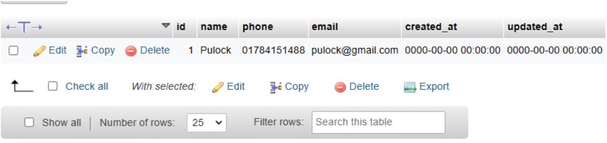

<br/>

### Step 1 :
#### Terminal command


```bash
php artisan make:migration add_address_to_users_table --table=users

```
<br/>

### Step 2 :
#### Add new migration file
```php
public function up(): void{
        Schema::table('users', function (Blueprint $table) {
            $table->string('address')->nullable()->after('phone');
        });
    }

    public function down(): void{
        Schema::table('users', function (Blueprint $table) {
            $table->dropColumn('address');
        });
    }

```
<br/>

### Step 3 :
#### Terminal command 
```bash 
php artisan migrate

```

## Output :
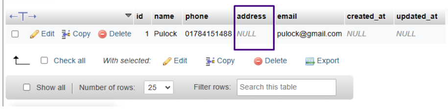
<br/>
<br/>

## Way of the foreign key:
 
<br/>
<!--  -->
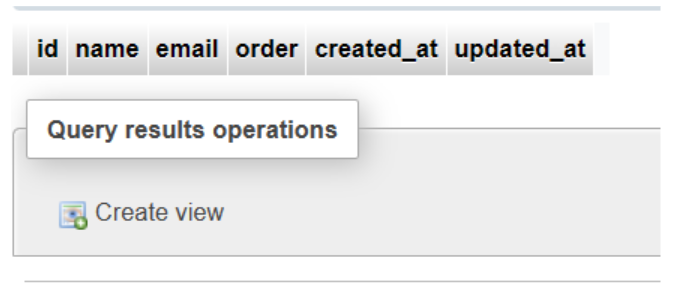
<br/>

### Step 1 :
#### Terminal command
```bash
php artisan make:migration add_address_to_users_table --table=users

```
<br/>

### Step 2 :
#### Add new migration file
```php
public function up(): void
    {
        Schema::table(customers, function (Blueprint $table) {
            // 1. Create new column
            // You probably want to make the new column nullable
            $table->integer('customer_id')->unsigned()->nullable()->after('password');


            // 2. Create foreign key constraints
            $table->foreign('customer_id')->references('id')->on('stores')->onDelete('SET NULL');
        });
    }

    /**
     * Reverse the migrations.
     */
    public function down(): void
    {
        Schema::table(customers, function (Blueprint $table) {
            // 1. Drop foreign key constraints
                $table->dropForeign(['customer_id']);
            // 2. Drop the column
                $table->dropColumn('customer_id');
        });
    }

```
<br/>

### Step 3 :
#### Terminal command 
```bash
php artisan migrate

```

## Output :
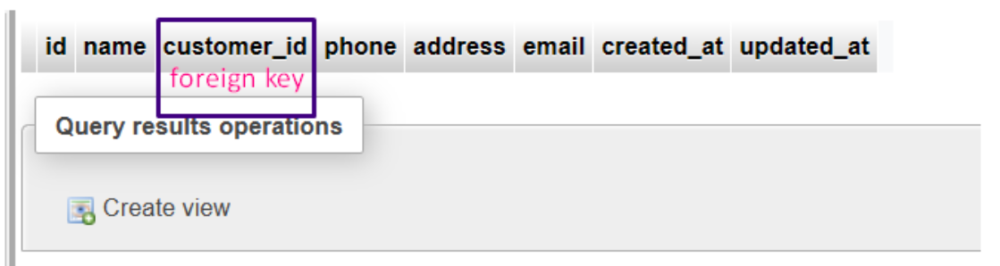


<br/>

# Types of delete for Laravel:

### Soft Delete : 
 <p>  Soft delete is a feature in Laravel that allows you to delete records without actually removing them from the database. Instead, Laravel marks the record as "deleted" by adding a timestamp to the deleted_at column of the table. This makes it possible to recover deleted records if needed. To use soft delete, you need to add the SoftDeletes trait to your model class and add a deleted_at column to your database table. </p>

 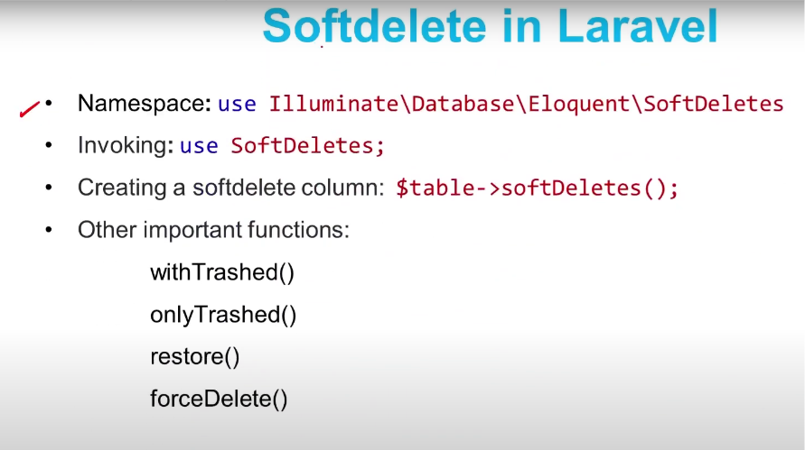
<br/>

### Demo Products Table :
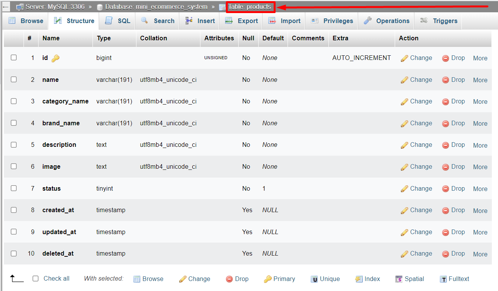
<br/>

### Step 1 :
#### Go to Product Model and use SoftDeletes 
```php
use Illuminate\Database\Eloquent\SoftDeletes;

class Product extends Model
{
  use SoftDeletes;
}

```
<br/>

### Step 2 :
#### Terminal command 
```bash
php artisan make:migration add_deleted_at_to_products_table --table=products

```
<br/>
<br/>

### Step 3 :
#### add_deleted_at_to_products_table   of include
```php
public function up()
    {
        Schema::table('products', function (Blueprint $table) {
            $table->softDeletes();
        });
    }
public function down()
    {
        Schema::table('products', function (Blueprint $table) {
            $table->dropSoftDeletes();
        });
    }

```
<br/>
<br/>

### Step 4 :
#### Terminal command 
```bash
php artisan migrate

```
<br/>

## Demo Products Table output :
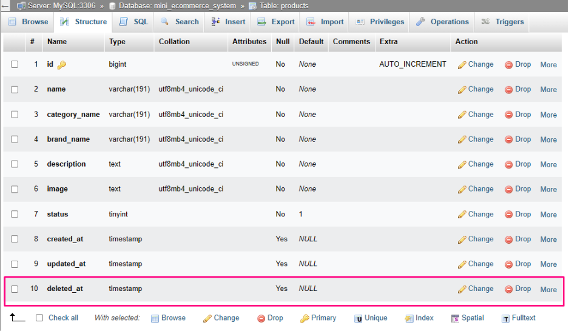
<br/>

### ProductController softDelete
```php
    public function trash(){
        return view('admin.product.trash-product', [
            'products' => Product::onlyTrashed()->get()
        ]);
    }


    public function undo($id){
        $product = Product::withTrashed()->find($id);
        $product->restore();
        return redirect('/product-trash')->with('message', 'Product restore successfully! and go to manage Page');
    }

```
<br/>

### ProductController Hard Delete
```php
    public function forceDelete($id){
        $product = Product::withTrashed()->find($id);
        $product->forceDelete();
        return redirect('/product-trash')->with('message', 'Product Delete successfully! ');
    }

```
<br/>

### Hard Delete : 
 <p>Hard delete is the traditional way of deleting records from a database. When you perform a hard delete, the record is completely removed from the database, and there is no way to recover it. To perform a hard delete in Laravel, you can use the delete() method on your model instance or the DB::delete() method if you want to delete records using a raw SQL query. </p>

<br/>

# Laravel Eloquent ORM:

### English Short note : 
<p> ORM stands for Object-Relational Mapping. It is a technique that developers use an object-oriented programming method Allows you to interact with relational databases. Generally, developers have to write different types of SQL queries to interact with the database. which is time-consuming and error-prone. With an ORM, developers can work with objects in the programming language of their choice. Simply put, ORM objects act as translators between developers and their databases. Basically, ORMs provide an abstraction layer between the application code and the database. Which makes code easier to write and maintain. ORMs Developers with low-level database details such as tables, columns and SQL statements Allows working with high-level abstractions like objects and classes instead of functions.
ORMs are usually database query, data insert, update and delete and tables
Provides functionality to manage relationships between These often include features such as caching, database migrations and schema management.
Overall, ORM reduces the amount of repetitive code required to interact with the database and Can simplify the development of database-driven applications by providing an easier way to work with data. </p>

### Bangla Short note : 
<p> ORM যা মূলত Object-Relational Mapping এর সংক্ষিপ্ত রূপ। এটি এমন একটি কৌশল যা ডেভেলপারদের একটি object-oriented programming Method ব্যবহার করে relational database এর সাথে যোগাযোগ করতে দেয়।
সাধারণত, ডেভেলপারদেরকে ডাটাবেসের সাথে ইন্টারঅ্যাক্ট করার জন্য বিভিন্ন ধরণের SQL query গুলো লিখতে হয়, যা সময়সাপেক্ষ এবং এবং অনেক ভুল থাকতে পারে। একটি ORM-এর সাহায্যে, ডেভেলপাররা তাদের পছন্দের programming language এর object গুলোর সাথে কাজ করতে পারে। আরো সহজ করে বললে ORM object ডেভেলপারদের এবং তাদের ডাটাবেসের মধ্যে ট্রান্সলেটর এর ভূমিকা পালন করে।
মূলতঃ ORM গুলি application code এবং database এর মধ্যে একটি abstraction layer প্রদান করে, যা কোড লেখা এবং বজায় রাখা সহজ করে তোলে। ORM গুলি ডেভেলপারদের low-level database details যেমন table সমূহ, columns এবং SQL statements এর সাথে কাজ করার পরিবর্তে objects এবং class গুলোর মতো high-level abstractions নিয়ে কাজ করার অনুমতি দেয়। 

ORM গুলো সাধারণত database query, data insert, update এবং delete করা এবং Table গুলোর মধ্যে relationships manage করার জন্য ফাঙ্কশনালিটি প্রদান করে। এগুলি প্রায়শই caching, ডাটাবেস migrations এবং schema management এর মতো features গুলি অন্তর্ভুক্ত করে।
সামগ্রিকভাবে, ORM ডাটাবেসের সাথে ইন্টারঅ্যাক্ট করার জন্য প্রয়োজনীয় repetitive code এর পরিমাণ হ্রাস করে এবং ডেটার সাথে কাজ করার আরও সহজ উপায় প্রদান করে database-driven application গুলির development কে সহজ করতে পারে।
</p>

#### For Example insert query  
```php
DB::table('users')->insert([
    'name' => 'John Doe',
    'email' => 'johndoe@example.com',
]);

```

#### For Example update  query  
```php
DB::table('users')
    ->where('id', 1)
    ->update(['name' => 'John Doe', 'email' => 'johndoe@example.com']);

```

#### For Example delete query  
```php
DB::table('users')->where('id', 1)->delete();

```
[ORM Link](https://w3programmers.com/bangla/eloquent-basics/ "ORM Link")


<br/>


# @stack() and      @push()      @endpush:

### For Example @stack : 

####  app.blade.php
```php
    <html>
    <head>
        <title>Website</title>
        @stack('head-scripts')
    </head>


    <body>
        <main>@yield('content')</main>

    @stack('body-scripts')
    </body>
    </html>
```
### For Example  @push : 

####  home.blade.php
```php
    @extends('layouts.app')
    @section('content')
        <div>Hello World</div>

        @push('body-scripts')
            @once
            <script src="https://unpkg.com/imask"></script>
            @endonce
        @endpush
    @endsection
```

<br/>
<br/>

# Use of Foreign key 

<p>In a relational database, a foreign key is a column or a set of columns that refers to the primary key or a unique key of another table. A foreign key constraint is a way to enforce referential integrity between the data in two tables.</p>

```php
   Schema::create('orders', function (Blueprint $table) {
    $table->id();
    $table->unsignedBigInteger('user_id');
    $table->foreign('user_id')->references('id')->on('users');
    // other columns...
});

```
```php
Schema::table('orders', function (Blueprint $table) {
    $table->unsignedBigInteger('user_id');
    $table->foreign('user_id')
          ->references('id')
          ->on('users')
          ->onDelete('cascade');
});

```
<br/>
<br/>

# Database Relationship 

<h2 align="center">One to One</h2>
 <br/>

### Migrate Customer Table 
```php
Schema::create('customers', function (Blueprint $table) {
            $table->id();
            $table->string('name');
            $table->string('email');
            $table->timestamps();
});

```

### Migrate Phone Table 
```php
Schema::create('phones', function (Blueprint $table) {
            $table->id();
            $table->string('name');
            $table->string('model');
            $table->integer('customer_id');
            $table->timestamps();
        });

```
### For Customer Model 
```php
class Customer extends Model
{
    use HasFactory;
    public function phone()
    {
        return $this->hasOne(Phone::class);
    }
}

```
### For Phone Model 
```php
 class Phone extends Model
{
    use HasFactory;
    public function customer()
    {
        return $this->belongsTo(Customer::class);
    }
}

```

### Controller Function 
```php
public function oneToOne(){
         $customers = Customer::all();
        return view('eloquentRelationship.oneToOne', compact('customers'));
    }

```

### View For blade file
```php
@foreach($customers as $data)
    <tr>
        <th scope="row">{{ $data->id }}</th>
        <td>{{ $data->name }}</td>
        <td>{{ $data->email }}</td>
        <td>{{ $data->phone->name }}</td>
        <td>{{ $data->phone->model }}</td>
        <td>
            <button type="button" class="btn btn-outline-primary">Edit</button>
            <button type="button" class="btn btn-outline-danger">Delete</button>
        </td>
    </tr>
@endforeach

```

<br/>


<h2 align="center">One to Many</h2>
 <br/>

### Comment Model  
```php
class Comment extends Model
{
    use HasFactory;
    public function post()
    {
        return $this->belongsTo(Post::class);
    }
}
```
### Post Model  
```php
class Post extends Model
{
    use HasFactory;
    public function comments()
    {
        return $this->hasMany(Comment::class);
    }

    public function categories()
    {
        return $this->belongsToMany(Category::class);
    }
}
```


<h2 align="center">Has One Through</h2>
 <br/>

### There have a three Table
- Mechanics
- Cars
- Woners
 <br/>

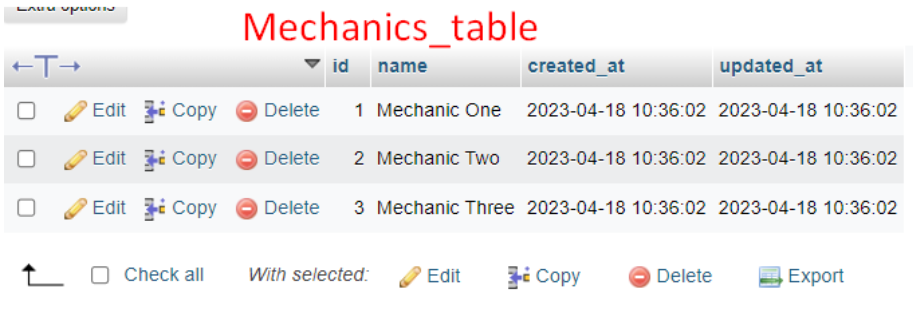
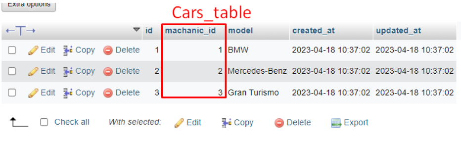
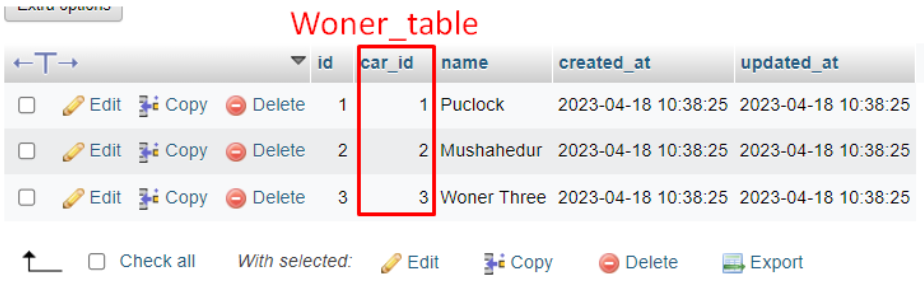

<br/>

### Mechanic Model  
```php
class Mechanic extends Model
{
    use HasFactory;

    public function carWoner()
    {
        return $this->hasOneThrough(Woner::class, Car::class);
    }
    public function carModel()
    {
        return $this->hasOne(Car::class);
    }
}

```


<br/>

### Controller method   
```php
public function hasOneThrough(){

    $mechanic = Mechanic::with('carWoner')->get();
    return view('eloquentRelationship.hasOneThrough', compact('mechanic'));
}

```


<br/>

## Output

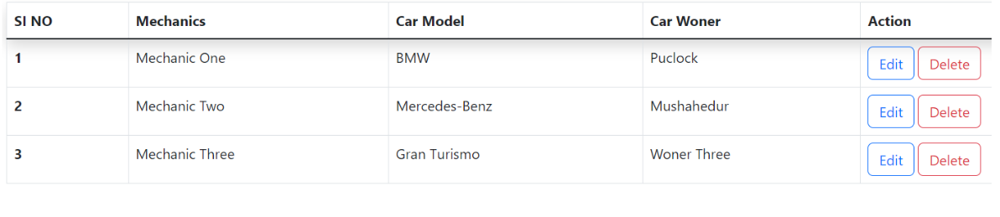


<h2 align="center">Many to Many Relation</h2>
 <br/>

### There have a three Table
- Produces
- Tags
- Product-Tags
 <br/>

### Produces Table   
```php
public function up(): void
    {
        Schema::create('products', function (Blueprint $table) {
            $table->id();
            $table->string('name');
            $table->string('price');
            $table->timestamps();
        });
    }
```
 <br/>

### Tag Table   
```php
public function up(): void
    {
        Schema::create('tags', function (Blueprint $table) {
            $table->id();
            $table->string('tag_name');
            $table->timestamps();
        });
    }
```
 <br/>

### ProducesTag Table   
```php
public function up(): void
    {
        Schema::create('product_tags', function (Blueprint $table) {
            $table->id();

            $table->unsignedBigInteger('product_id');
            $table->foreign('product_id')->references('id')->on('products');
            $table->unsignedBigInteger('tag_id');
            $table->foreign('tag_id')->references('id')->on('tags');
            $table->timestamps();
        });
    }
```
<br/>

## Relation three Model
- 
### Produces Model   
```php
    protected $gureded = [];

    function tags(){
        return $this->belongsToMany(Tag::class, 'product_tags');
    }
```
 
 
 ### Tag Model   
```php
    protected $gureded = [];

    function products(){
        return $this->belongsToMany(Product::class, 'product_tags');
    }
```

### ProducesTag Model   
```php
    protected $gureded = [];
```
 
<br/>

## Sevaral way show  Output

```php
   //return Product::with('tags')->find(2);
   return Tag::with('products')->get();
```
 <br/>
  <br/>
   <br/>
  <br/>

<h2 align="center">Many to many polyMorphic relationship</h2>
 <br/>


<br/>


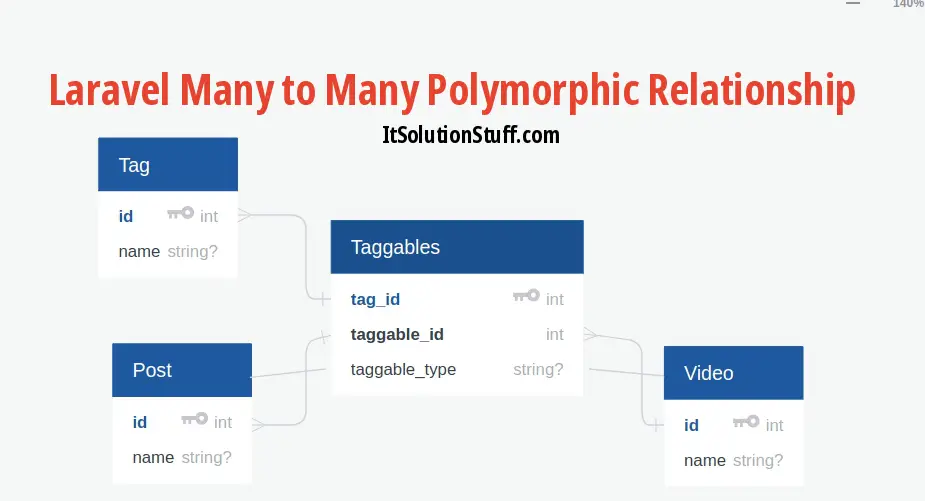

<br/>


### This is the comment table Schema: 

```php
Schema::create('comments', function (Blueprint $table) {
    $table->increments('id');
    $table->morphs('commentable');
    $table->text('comment')->nullable();
    $table->timestamps();
});

```

<br>

### This is Image Model comment Function

```php
public function comments()
{
    return $this->morphMany(Comment::class,'commentable');
     //App\Models\ImageModel
}
```

<br>

### This is Post Model comment Function

```php
public function comments()
{
    return $this->morphMany(Comment::class,'commentable');
                //App\Models\PostModel
}
```


<br>

### How to get All post with comment By HomeController 

```php
function blogIndex(){
    $post = PostModel::with('comments')->orderBy('id', 'desc')->take(4)->get();
    return view('website.pages.blog_page',compact('post') );
}

```


<br>

### How to get All Image with comment By HomeController 

```php
function imageIndex(){
        $image = ImageModel::with('comments')->orderBy('id', 'desc')->take(6)->get();


        return view('website.pages.image_page',compact('image'));
     }
```

[Polymorphic Relationships Link](https://blog.logrocket.com/polymorphic-relationships-laravel/ "Polymorphic Relationships Link")

<br>
<br>


# Query Parameter 
 <br/>

<p>A query parameter, also known as a query string parameter or URL parameter, is a way to pass data from a client (such as a web browser) to a server as part of a URL.</p>


<p>Query parameters are added to the end of a URL after a question mark ? and consist of one or more key-value pairs, separated by an ampersand &. For example, consider the following URL with query parameters: </p>

[Link](https://example.com/search?q=apple&category=fruits "Query Parameter Link")


<p>In this URL, q and category are the keys, and apple and fruits are the corresponding values. The server can extract the values of these parameters and use them to perform a search or filter the results.</p>


 <br/>

<br/>
<br/>
<br/>
<br/>


