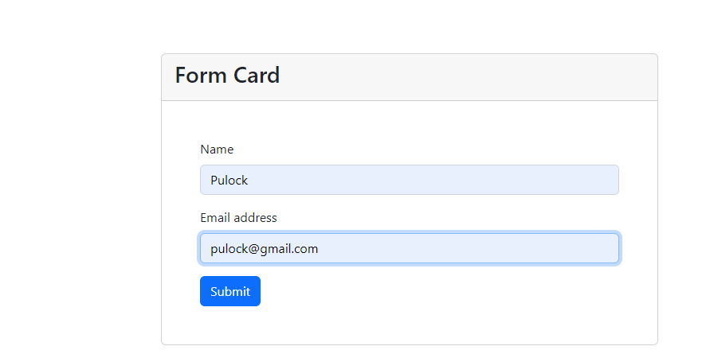
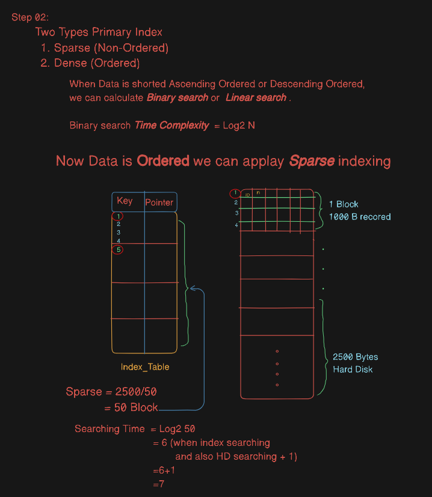

<!--markdown tutorial-->


 <br/>
 
---
  <br/>

# Table of Contents

- [Introduction](#introduction)
- [PHP Cheat Sheet](#php_cheat_sheet)
 -- ## বিষয়বস্তু
 - [স্ট্রিং ম্যানিপুলেশন ফাংশন](#স্ট্রিং-ম্যানিপুলেশন-ফাংশন)
 - [অ্যারে ফাংশন](#অ্যারে-ফাংশন)
 - [অ্যারে সর্টিং ফাংশন](#অ্যারে-সর্টিং-ফাংশন)
 - [ফাইল ও ফোল্ডার সিস্টেম ফাংশন](#ফাইল-ও-ফোল্ডার-সিস্টেম-ফাংশন)
 - [সার্ভার ফাংশন](#সার্ভার-ফাংশন)
 - [তারিখ ফাংশন](#তারিখ-ফাংশন)
 - [গাণিতিক ফাংশন](#গাণিতিক-ফাংশন)
 - [রেগুলার এক্সপ্রেশন ফাংশন](#রেগুলার-এক্সপ্রেশন-ফাংশন)
 - [কন্ট্রিবিউশন](#কন্ট্রিবিউশন)
 - [লাইসেন্স](#লাইসেন্স)
- [Data pass to view blade file](#data-pass)
  - [Using the view() function](#view-function)
  - [Using the with() method](#with-method)
  - [Using the compact()](#compact)
  - [Data pass to array function](#array_function)
  - [Fetch the data in the controller](#fetch-the-data)
- [Abstraction Vs Interfaces](#abstraction-interfaces)
  - [What is the trait in PHP](#trait-in-php)
- [Laravel Add a new column to existing table in a migration](#add-column)
  - [Normal Way](#normal-way)
  - [Way of the foreign key](#way-of-foreign-key)
- [Types of delete for Laravel](#types-of-delete)
  - [Soft Delete](#soft-delete)
  - [Hard Delete](#hard-delete)
- [Laravel Eloquent ORM](#laravel-eloquent)
- [ @stack() and @push() @endpush](#stack-push)
  - [Stack](#stack)
  - [Push](#push)
- [Use of Foreign key](#use-foreign-key)
- [Database Relationship](#database-relationship)
  - [One to One](#one-2-one)
  - [One to Many](#one-2-many)
  - [Has One Through](#has-1-through)
  - [Many to Many Relation](#many-2-many)
  - [Many to many polyMorphic Relationship](#many-2-many-polymorphic)
- [Query Parameter](#query-parameter)
- [Mail Notification](#mail_notification)
- [Localization Language Switcher](#localization_language_switcher)
- [Learn Database](#learn_database)
    - [Primary key VS Unique key](#primary_key_vs_unique_key)

- [SOLID Design Principles](#solid)
  - [Single Responsibility Principle](#srp)
  - [Open-Closed Principle](#ocp)
  - [Liskov Substitution Principleh](#lsp)
  - [Interface Segregation Principle](#isp)
  - [Dependency Inversion Principle](#dip)
- [Use Request Class](#request_class)
- [Redirect to login from register](#redirect_to_login)
- [Create & Update Form need to refactor(DRY)](#refactor)
- [Route Model Binding](#route_model_binding)
- [Accessor & Mutator](#acc_mut)
    - [Accessor](#accessor)
    - [Mutator](#mutator)
- [Search and Build a filter (Popup)](#filtering)
- [CSRF](#csrf)
- [View Table](#about_view)
    - [Views in SQL](#view_in_sql)
    - [Types of View](#types_of_view)
    - [Advantages of View](#advantages_of_view)
- [Nomalizeton](#normalizetion)
    - [Data Redundancy](#data_redundancy)
    - [Data Redundancy](#data_integrity)
    - [First normal form (1NF)](#1nf)
    - [Second normal form (2NF) ](#2nf)
    - [Third normal form (3NF)](#3nf)
- [Indexing in DBMS](#indexing)
  - [Input/Output Cost in Indexing](#i_o_cost)  
- [Course Contents of SQL](#course_contents)
  - [Introduction & Pre-Requisites](#rpe_requisites)
  - [Basic SQL](#basic)
    - [SQL Commands](#commands)
        - [Data Types](#data_types)
        - [Constraints](#constraints)
        - [Normalization in SQL](#normalization_sql)
        - [Operator](#operator)
        - [CASE statement](#case_statement)
        - [Important SQL clause](#important_sql_clause)
        - [INNER join](#inner_join)
        
        
  
- [Role-Permission Work Flow](#role_permission)


- [Mini Project](#project)

<br/>
<br/>
<br/>

# Introduction <a name="introduction"></a>

<p>When I learn in daily life, then I put the main topic with an explanation. Because of the quick reminder of my valuable information. So, under the same table of contents.</p> 

<br/>
<br/>
# List of topics

 | SI No         | Topic                  |
 | ------------ | ---------------------- |
 | 01 | Data pass to view blade file  |
 | 02 | Abstraction Vs Interfaces |
 | 04 | Laravel Add a new column to existing table in a migration|
 | 05 | Types of delete Laravel |
 | 06 | Laravel Eloquent ORM |
 | 07 | @stack() and      @push()      @endpush |
 | 08 | Foreign key use  |
 | 09 | Database Relationship |
 | 10 | Query Parameter |

<!-- all link is here -->

<br/>
<br/>
## স্ট্রিং ম্যানিপুলেশন ফাংশন
| ফাংশন | বর্ণনা | উদাহরণ |
| --- | --- | --- |
| `strlen()` | স্ট্রিংয়ের দৈর্ঘ্য ফেরত দেয় | ```php
| `strtolower()` | স্ট্রিংকে ছোট হাতের অক্ষরে রূপান্তর করে | ```php echo strtolower("HELLO"); // hello ``` |
| `strtoupper()` | স্ট্রিংকে বড় হাতের অক্ষরে রূপান্তর করে | ```php echo strtoupper("hello"); // HELLO ``` |
| `ucfirst()` | প্রথম অক্ষরকে বড় হাতে করে | ```php echo ucfirst("hello"); // Hello ``` |
| `ucwords()` | প্রতিটি শব্দের প্রথম অক্ষর বড় হাতে করে | ```php echo ucwords("hello world"); // Hello World ``` |
| `strrev()` | স্ট্রিংকে উল্টো করে | ```php echo strrev("Hello"); // olleH ``` |
| `strpos()` | সাবস্ট্রিংয়ের প্রথম ঘটনার অবস্থান খুঁজে | ```php echo strpos("Hello World", "World"); // 6 ``` |
| `str_replace()` | সাবস্ট্রিং প্রতিস্থাপন করে | ```php echo str_replace("world", "PHP", "Hello world"); // Hello PHP ``` |
| `substr()` | স্ট্রিংয়ের একটি অংশ ফেরত দেয় | ```php echo substr("Hello World", 6, 5); // World ``` |
| `trim()` | শুরু এবং শেষ থেকে স্পেস সরায় | ```php echo trim(" Hello "); // Hello ``` |

## অ্যারে ফাংশন
| ফাংশন | বর্ণনা | উদাহরণ |
| --- | --- | --- |
| `count()` | অ্যারেতে উপাদানের সংখ্যা ফেরত দেয় | ```php echo count([1, 2, 3]); // 3 ``` |
| `array_push()` | অ্যারের শেষে উপাদান যোগ করে | ```php $arr = [1, 2]; array_push($arr, 3); print_r($arr); // [1,2,3] ``` |
| `array_pop()` | শেষ উপাদান সরায় এবং ফেরত দেয় | ```php $arr = [1, 2, 3]; echo array_pop($arr); // 3 ``` |
| `array_shift()` | প্রথম উপাদান সরায় এবং ফেরত দেয় | ```php $arr = [1, 2, 3]; echo array_shift($arr); // 1 ``` |
| `array_unshift()` | অ্যারের শুরুতে উপাদান যোগ করে | ```php $arr = [2, 3]; array_unshift($arr, 1); print_r($arr); // [1,2,3] ``` |
| `in_array()` | অ্যারেতে মান আছে কি না চেক করে | ```php echo in_array(2, [1, 2, 3]); // 1 ``` |
| `array_merge()` | দুই বা ততোধিক অ্যারে একত্রিত করে | ```php $arr = array_merge([1, 2], [3, 4]); print_r($arr); // [1,2,3,4] ``` |
| `array_keys()` | অ্যারের কীগুলো ফেরত দেয় | ```php $arr = ["a" => 1, "b" => 2]; print_r(array_keys($arr)); // ["a", "b"] ``` |
| `array_values()` | অ্যারের মানগুলো ফেরত দেয় | ```php $arr = ["a" => 1, "b" => 2]; print_r(array_values($arr)); // [1,2] ``` |
| `array_filter()` | কলব্যাক ফাংশন দিয়ে উপাদান ফিল্টার করে | ```php print_r(array_filter([1, 2, 3, 4], fn($n) => $n > 2)); // [3,4] ``` |

## অ্যারে সর্টিং ফাংশন
| ফাংশন | বর্ণনা | উদাহরণ |
| --- | --- | --- |
| `sort()` | অ্যারেকে উর্ধ্বক্রমে সর্ট করে | ```php $arr = [3, 1, 2]; sort($arr); print_r($arr); // [1,2,3] ``` |
| `rsort()` | অ্যারেকে নিম্নক্রমে সর্ট করে | ```php $arr = [3, 1, 2]; rsort($arr); print_r($arr); // [3,2,1] ``` |
| `asort()` | অ্যাসোসিয়েটিভ অ্যারেকে মান অনুযায়ী সর্ট করে, কী সংরক্ষণ করে | ```php $arr = ["b" => 2, "a" => 1]; asort($arr); print_r($arr); // ["a" => 1, "b" => 2] ``` |
| `arsort()` | অ্যাসোসিয়েটিভ অ্যারেকে মান অনুযায়ী নিম্নক্রমে সর্ট করে | ```php $arr = ["b" => 2, "a" => 1]; arsort($arr); print_r($arr); // ["b" => 2, "a" => 1] ``` |
| `ksort()` | অ্যাসোসিয়েটিভ অ্যারেকে কী অনুযায়ী উর্ধ্বক্রমে সর্ট করে | ```php $arr = ["b" => 2, "a" => 1]; ksort($arr); print_r($arr); // ["a" => 1, "b" => 2] ``` |
| `krsort()` | অ্যাসোসিয়েটিভ অ্যারেকে কী অনুযায়ী নিম্নক্রমে সর্ট করে | ```php $arr = ["b" => 2, "a" => 1]; krsort($arr); print_r($arr); // ["b" => 2, "a" => 1] ``` |
| `array_multisort()` | একাধিক বা মাল্টিডাইমেনশনাল অ্যারে সর্ট করে | ```php $arr1 = [3, 1, 2]; $arr2 = ["c", "a", "b"]; array_multisort($arr1, $arr2); print_r($arr1); // [1,2,3] print_r($arr2); // ["a","b","c"] ``` |
| `usort()` | ব্যবহারকারী-নির্ধারিত ফাংশন দিয়ে অ্যারে সর্ট করে | ```php $arr = [3, 1, 2]; usort($arr, fn($a, $b) => $a <=> $b); print_r($arr); // [1,2,3] ``` |
| `uasort()` | অ্যাসোসিয়েটিভ অ্যারেকে মান দিয়ে সর্ট করে, কী সংরক্ষণ করে | ```php $arr = ["b" => 2, "a" => 1]; uasort($arr, fn($a, $b) => $a <=> $b); print_r($arr); // ["a" => 1, "b" => 2] ``` |
| `uksort()` | অ্যাসোসিয়েটিভ অ্যারেকে কী দিয়ে সর্ট করে | ```php $arr = ["b" => 2, "a" => 1]; uksort($arr, fn($a, $b) => strcmp($a, $b)); print_r($arr); // ["a" => 1, "b" => 2] ``` |

## ফাইল ও ফোল্ডার সিস্টেম ফাংশন
| ফাংশন | বর্ণনা | উদাহরণ |
| --- | --- | --- |
| `file_get_contents()` | ফাইলের বিষয়বস্তু স্ট্রিং হিসেবে পড়ে | ```php echo file_get_contents("file.txt"); ``` |
| `file_put_contents()` | স্ট্রিং ফাইলে লেখে | ```php file_put_contents("file.txt", "Hello World"); ``` |
| `fopen()` | ফাইল পড়া/লেখার জন্য খোলে | ```php $file = fopen("file.txt", "w"); ``` |
| `fclose()` | খোলা ফাইল বন্ধ করে | ```php fclose($file); ``` |
| `file_exists()` | ফাইল আছে কি না চেক করে | ```php echo file_exists("file.txt"); // true ``` |
| `unlink()` | ফাইল মুছে ফেলে | ```php unlink("file.txt"); ``` |
| `is_dir()` | ডিরেক্টরি আছে কি না চেক করে | ```php echo is_dir("folder"); // true ``` |
| `mkdir()` | নতুন ডিরেক্টরি তৈরি করে | ```php mkdir("new_folder"); ``` |
| `rmdir()` | খালি ডিরেক্টরি মুছে ফেলে | ```php rmdir("folder"); ``` |
| `touch()` | নতুন খালি ফাইল তৈরি করে | ```php touch("newfile.txt"); ``` |
| `rename()` | ফাইলের নাম পরিবর্তন বা সরায় | ```php rename("oldfile.txt", "newfile.txt"); ``` |

## সার্ভার ফাংশন
| ফাংশন | বর্ণনা | উদাহরণ |
| --- | --- | --- |
| `phpinfo()` | PHP কনফিগারেশন তথ্য দেখায় | ```php phpinfo(); ``` |
| `$_SERVER['PHP_SELF']` | চলমান স্ক্রিপ্টের ফাইলনেম ফেরত দেয় | ```php echo $_SERVER['PHP_SELF']; ``` |
| `$_SERVER['REMOTE_ADDR']` | ব্যবহারকারীর আইপি অ্যাড্রেস ফেরত দেয় | ```php echo $_SERVER['REMOTE_ADDR']; ``` |
| `$_SERVER['HTTP_HOST']` | বর্তমান হোস্ট নাম ফেরত দেয় | ```php echo $_SERVER['HTTP_HOST']; ``` |

## তারিখ ফাংশন
| ফাংশন | বর্ণনা | উদাহরণ |
| --- | --- | --- |
| `date()` | স্থানীয় তারিখ/সময় ফরম্যাট করে | ```php echo date("Y-m-d"); // 2025-01-30 ``` |
| `time()` | বর্তমান Unix টাইমস্ট্যাম্প ফেরত দেয় | ```php echo time(); ``` |
| `strtotime()` | স্ট্রিংকে Unix টাইমস্ট্যাম্পে রূপান্তর করে | ```php echo date("Y-m-d", strtotime("+1 week")); ``` |
| `mktime()` | তারিখের জন্য Unix টাইমস্ট্যাম্প ফেরত দেয় | ```php echo date("Y-m-d", mktime(0,0,0,12,25,2025)); ``` |

## গাণিতিক ফাংশন
| ফাংশন | বর্ণনা | উদাহরণ |
| --- | --- | --- |
| `abs()` | পরম মান ফেরত দেয় | ```php echo abs(-5); // 5 ``` |
| `ceil()` | সংখ্যাকে উপরের দিকে রাউন্ড করে | ```php echo ceil(4.3); // 5 ``` |
| `floor()` | সংখ্যাকে নিচের দিকে রাউন্ড করে | ```php echo floor(4.9); // 4 ``` |
| `round()` | সংখ্যাকে রাউন্ড করে | ```php echo round(4.6); // 5 ``` |
| `sqrt()` | বর্গমূল ফেরত দেয় | ```php echo sqrt(16); // 4 ``` |
| `pow()` | সংখ্যাকে পাওয়ারে উন্নীত করে | ```php echo pow(2,3); // 8 ``` |
| `rand()` | র্যান্ডম সংখ্যা তৈরি করে | ```php echo rand(1, 10); // 1-10 এর মধ্যে র্যান্ডম ``` |
| `max()` | সর্বোচ্চ মান ফেরত দেয় | ```php echo max(2, 5, 3); // 5 ``` |
| `min()` | সর্বনিম্ন মান ফেরত দেয় | ```php echo min(2, 5, 3); // 2 ``` |

## রেগুলার এক্সপ্রেশন ফাংশন
| ফাংশন | বর্ণনা | উদাহরণ |
| --- | --- | --- |
| `preg_match()` | প্যাটার্নের সাথে স্ট্রিং মেলে কি না চেক করে | ```php echo preg_match("/hello/", "hello world"); // 1 ``` |
| `preg_match_all()` | প্যাটার্নের সব মিল খুঁজে বের করে | ```php preg_match_all("/\d+/", "abc 123 def 456", $matches); print_r($matches[0]); // [123, 456] ``` |
| `preg_replace()` | প্যাটার্নের মিল প্রতিস্থাপন করে | ```php echo preg_replace("/world/", "PHP", "Hello world!"); // Hello PHP! ``` |
| `preg_filter()` | `preg_replace()` এর মতো, শুধুমাত্র পরিবর্তিত উপাদান ফেরত দেয় | ```php $arr = ["apple", "banana", "cherry"]; print_r(preg_filter("/a/", "@", $arr)); // ["@pple", "b@n@n@", "cherry"] ``` |
| `preg_split()` | প্যাটার্ন দিয়ে স্ট্রিং ভাগ করে | ```php $arr = preg_split("/[\s,]+/", "one, two three"); print_r($arr); // ["one", "two", "three"] ``` |
| `preg_replace_callback()` | কলব্যাক ফাংশন দিয়ে মিল প্রতিস্থাপন করে | ```php echo preg_replace_callback("/\d+/", fn($m) => $m[0] * 2, "Price: 50"); // Price: 100 ``` |
| `preg_replace_callback_array()` | একাধিক রেগেক্স প্রতিস্থাপন কলব্যাক দিয়ে করে | ```php echo preg_replace_callback_array(["/\d+/" => fn($m) => $m[0] * 2, "/hello/" => fn($m) => "hi"], "hello 50"); // hi 100 ``` |

## কন্ট্রিবিউশন
এই Cheat Sheet উন্নত করতে চান? ফর্ক করুন, পরিবর্তন করুন এবং পুল রিকোয়েস্ট পাঠান! নতুন ফাংশন বা উদাহরণ যোগ করতে স্বাগত। দয়া করে [কন্ট্রিবিউশন গাইডলাইন](CONTRIBUTING.md) দেখুন।

## লাইসেন্স
এই প্রজেক্ট MIT লাইসেন্সের অধীনে রয়েছে। বিস্তারিত জানতে [LICENSE](LICENSE) ফাইলটি দেখুন।

---

⭐ যদি এই Cheat Sheet আপনার কাজে লাগে, তাহলে রিপোজিটরিতে একটি স্টার দিন! 🚀

<br/><br/><br/>
<br/>


## Data pass to view blade file <a name="data-pass"></a>

### 1. Using the view() function <a name="view-function"></a>

<p>You can use the view() function to return a view and pass data to it as an array or an instance of the Illuminate\Contracts\Support\Arrayable interface.

 For example:
</p>

<br/>

```php
 public function index()
    {
        $data = [
            'title' => 'Welcome to my website',
            'content' => 'This is some content that will be displayed on the page',
        ];
        return view('my-view', $data);
    }
```

<br/>


### 2. Using the with() method: <a name="with-method"></a>
<p> You can also use the with() method to pass data to the view. This method allows you to chain multiple calls to pass multiple data pieces.
 
 For example:
</p>

<br/>

```php
 public function index()
{
    return view('my-view')
        ->with('title', 'Welcome to my website')
        ->with('content', 'This is some content that will be displayed on the page');
}

```

<br/>
<p> For example:</p>

```php
 use App\Models\Post;
    use App\Models\User;
    public function index()
    {
        $posts = Post::with('user')->get();
        return view('my-view', ['posts' => $posts]);
    }

```

<br/>

#### View blade file by foreach loop:

```php
 @foreach ($posts as $post)
        <h2>{{ $post->title }}</h2>
        <p>{{ $post->content }}</p>
        <p>Author: {{ $post->user->name }}</p>
    @endforeach

```

<br/>


### 3. Using the compact() : <a name="compact"></a>
<p> You can use the compact() function to create an array of variables and their values, which can then be passed to the view. 

 For example:

</p>

<br/>

```php
 public function index()
{
    $users      = User::get();
    $products   = Product::get();
    return view('my-view', compect('users', 'products'));
}

```

<br/>
<br/>


### 4. Data pass to array function: <a name="array_function"></a>  
<p> When i have many value pass the blade file then we can use get_defined_vars() this function . 

 For example:

</p>

<br/>

```php
 public function index()
{
    $users      = User::get();
    $posts      = Post::get();
    $products   = Product::get();
    $orders   = Order::get();
    $shops   = Shop::get();
    $customers   = Customer::get();
     return view('frontend.pages.home.index', get_defined_vars());
}

```

<br/>
<br/>

#### View blade file by foreach loop:

```php

This is post
    @foreach ($posts as $post)
        <h2>{{ $post->title }}</h2>
        <p>{{ $post->content }}</p>
        <p>Author: {{ $post->user->name }}</p>
    @endforeach

This is customer
    @foreach ($customers as $customer)
        <h2>{{ $customer->title }}</h2>
        <p>{{ $customer->content }}</p>
        <p>Author: {{ $customer->user->name }}</p>
    @endforeach

    This is post
    @foreach ($posts as $post)
        <h2>{{ $post->title }}</h2>
        <p>{{ $post->content }}</p>
        <p>Author: {{ $post->user->name }}</p>
    @endforeach

    This is post
    @foreach ($shops as $shop)
        <h2>{{ $shop->title }}</h2>
        <p>{{ $shop->content }}</p>
        <p>Author: {{ $shop->user->name }}</p>
    @endforeach

    This is post
    @foreach ($orders as $order)
        <h2>{{ $order->title }}</h2>
        <p>{{ $order->content }}</p>
        <p>Author: {{ $order->user->name }}</p>
    @endforeach
```

<br/>


### 5. Fetch the data in the controller : <a name="fetch-the-data"></a>
<p> In your controller, you can fetch the data from the database using the model you just created.

 For example:

</p>

<br/>

```php
 use App\Models\Post;
    public function index()
    {
        $posts = Post::all();
        return view('my-view', ['posts' => $posts]);
    }
    
```

<br/>

#### View blade file by foreach loop:

```php
 @foreach ($posts as $post)
        <h2>{{ $post->title }}</h2>
        <p>{{ $post->content }}</p>
        <p>Author: {{ $post->user->name }}</p>
    @endforeach


```

<br/>

## Abstraction Vs Interfaces: <a name="abstraction-interfaces"></a>

### Abstraction : 
 <p> The main reason for using abstraction is to hide unnecessary details from the user. Only relevant data from a large program is shown to the user. It also helps to reduce the complexity of the program. </p>

 <br/>

### Interfaces : 
 <p> An interface is a layer of communication with a system. If you press various buttons on the mobile then there is an interface part: </p>


 <p> Definition of interfaces. It says what the interface can do. Actions are "abstract" to you, you don't know what's going on inside. Implementation of an interface, which tells exactly how the interface works. </p>

<br/>


 | SI No      | Abstract Class           |        Interface       |
 | ---------- | ------------------------ | ---------------------- |
 | 01 | An abstract class can contain both abstract and non-abstract methods.  | Interface contains only abstract methods. |
 | 02 | To declare abstract class abstract keywords are used. | The interface can be declared with the interface keyword.|
 | 03 | It supports multiple inheritance. | It does not support multiple inheritance.|
 | 04 | The keyword ‘extend’ is used to extend an abstract class | The keyword implement is used to implement the interface.|
 | 05 | It has class members like private and protected, etc. | It has class members public by default.|

<br/>
<br/>
<br/>


### What is the trait in PHP: <a name="trait-in-php"></a>

### 1. Using the view() function

<p>Usually PHP is called Single Inheritance Language, that is, PHP Language does not support Multiple Inheritance. And Trait is a new concept to remove the limitations of Single Inheritance in PHP OOP and use Multiple Inheritance. which was first used in PHP 5.4. Traits are much like classes, Traits are defined like classes using the trait keyword. However, an object like a class cannot be created from it. But properties and methods of multiple traits can be used in a single class. Now let's understand better through an example:</p>

<br/>
<h3>File Name: foo.php </h3>

<br/>

```php
 <?php
        trait Foo
        {
            public function sayHello(){
                return "Hello";
            }
            public function sayWorld(){
            return "World";
            }
        }
    ?>
```

 
<br/>

<h3>Trait is used in classes using the use keyword. Let's look at an example using trait : </h3>

<br/>
<h4>File Name: bar.php</h4>


```php
 <?php
        include("foo.php");
        class Bar{
            // Using the Trait Here
            use Foo;
        }
        $obj = new Bar;
        // Executing the method from trait
        $obj->sayHello(); //Hello
        $obj->sayWorld(); // World
        ?>

```

<br/>

## Laravel Add a new column to existing table in a migration: <a name="add-column"></a>

### 1. Normal Way: <a name="normal-way"></a>
 
<br/>
<!--  -->


<br/>

### Step 1 :
#### Terminal command


```bash
php artisan make:migration add_address_to_users_table --table=users

```
<br/>

### Step 2 :
#### Add new migration file
```php
public function up(): void{
        Schema::table('users', function (Blueprint $table) {
            $table->string('address')->nullable()->after('phone');
        });
    }

    public function down(): void{
        Schema::table('users', function (Blueprint $table) {
            $table->dropColumn('address');
        });
    }

```
<br/>

### Step 3 :
#### Terminal command 
```bash 
php artisan migrate

```

## Output :

<br/>
<br/>

### Way of the foreign key: <a name="way-of-foreign-key"></a>
 
<br/>
<!--  -->

<br/>

### Step 1 :
#### Terminal command
```bash
php artisan make:migration add_address_to_users_table --table=users

```
<br/>

### Step 2 :
#### Add new migration file
```php
public function up(): void
    {
        Schema::table(customers, function (Blueprint $table) {
            // 1. Create new column
            // You probably want to make the new column nullable
            $table->integer('customer_id')->unsigned()->nullable()->after('password');


            // 2. Create foreign key constraints
            $table->foreign('customer_id')->references('id')->on('stores')->onDelete('SET NULL');
        });
    }

    /**
     * Reverse the migrations.
     */
    public function down(): void
    {
        Schema::table(customers, function (Blueprint $table) {
            // 1. Drop foreign key constraints
                $table->dropForeign(['customer_id']);
            // 2. Drop the column
                $table->dropColumn('customer_id');
        });
    }

```
<br/>

### Step 3 :
#### Terminal command 
```bash
php artisan migrate

```

## Output :


<br/>

## Types of delete for Laravel:<a name="types-of-delete"></a>

### Soft Delete :<a name="soft-delete"></a> 
 <p>  Soft delete is a feature in Laravel that allows you to delete records without actually removing them from the database. Instead, Laravel marks the record as "deleted" by adding a timestamp to the deleted_at column of the table. This makes it possible to recover deleted records if needed. To use soft delete, you need to add the SoftDeletes trait to your model class and add a deleted_at column to your database table. </p>

 
<br/>

### Demo Products Table :

<br/>

### Step 1 :
#### Go to Product Model and use SoftDeletes 
```php
use Illuminate\Database\Eloquent\SoftDeletes;

class Product extends Model
{
  use SoftDeletes;
}

```
<br/>

### Step 2 :
#### Terminal command 
```bash
php artisan make:migration add_deleted_at_to_products_table --table=products

```
<br/>
<br/>

### Step 3 :
#### add_deleted_at_to_products_table   of include
```php
public function up()
    {
        Schema::table('products', function (Blueprint $table) {
            $table->softDeletes();
        });
    }
public function down()
    {
        Schema::table('products', function (Blueprint $table) {
            $table->dropSoftDeletes();
        });
    }

```
<br/>
<br/>

### Step 4 :
#### Terminal command 
```bash
php artisan migrate

```
<br/>

## Demo Products Table output :

<br/>

### ProductController softDelete
```php
    public function trash(){
        return view('admin.product.trash-product', [
            'products' => Product::onlyTrashed()->get()
        ]);
    }


    public function undo($id){
        $product = Product::withTrashed()->find($id);
        $product->restore();
        return redirect('/product-trash')->with('message', 'Product restore successfully! and go to manage Page');
    }

```
<br/>

### ProductController Hard Delete <a name="hard-delete"></a>
```php
    public function forceDelete($id){
        $product = Product::withTrashed()->find($id);
        $product->forceDelete();
        return redirect('/product-trash')->with('message', 'Product Delete successfully! ');
    }

```
<br/>

### Hard Delete : 
 <p>Hard delete is the traditional way of deleting records from a database. When you perform a hard delete, the record is completely removed from the database, and there is no way to recover it. To perform a hard delete in Laravel, you can use the delete() method on your model instance or the DB::delete() method if you want to delete records using a raw SQL query. </p>

<br/>

## Laravel Eloquent ORM:<a name="laravel-eloquent"></a>

### English Short note : 
<p> ORM stands for Object-Relational Mapping. It is a technique that developers use an object-oriented programming method Allows you to interact with relational databases. Generally, developers have to write different types of SQL queries to interact with the database. which is time-consuming and error-prone. With an ORM, developers can work with objects in the programming language of their choice. Simply put, ORM objects act as translators between developers and their databases. Basically, ORMs provide an abstraction layer between the application code and the database. Which makes code easier to write and maintain. ORMs Developers with low-level database details such as tables, columns and SQL statements Allows working with high-level abstractions like objects and classes instead of functions.
ORMs are usually database query, data insert, update and delete and tables
Provides functionality to manage relationships between These often include features such as caching, database migrations and schema management.
Overall, ORM reduces the amount of repetitive code required to interact with the database and Can simplify the development of database-driven applications by providing an easier way to work with data. </p>

### Bangla Short note : 
<p> ORM যা মূলত Object-Relational Mapping এর সংক্ষিপ্ত রূপ। এটি এমন একটি কৌশল যা ডেভেলপারদের একটি object-oriented programming Method ব্যবহার করে relational database এর সাথে যোগাযোগ করতে দেয়।
সাধারণত, ডেভেলপারদেরকে ডাটাবেসের সাথে ইন্টারঅ্যাক্ট করার জন্য বিভিন্ন ধরণের SQL query গুলো লিখতে হয়, যা সময়সাপেক্ষ এবং এবং অনেক ভুল থাকতে পারে। একটি ORM-এর সাহায্যে, ডেভেলপাররা তাদের পছন্দের programming language এর object গুলোর সাথে কাজ করতে পারে। আরো সহজ করে বললে ORM object ডেভেলপারদের এবং তাদের ডাটাবেসের মধ্যে ট্রান্সলেটর এর ভূমিকা পালন করে।
মূলতঃ ORM গুলি application code এবং database এর মধ্যে একটি abstraction layer প্রদান করে, যা কোড লেখা এবং বজায় রাখা সহজ করে তোলে। ORM গুলি ডেভেলপারদের low-level database details যেমন table সমূহ, columns এবং SQL statements এর সাথে কাজ করার পরিবর্তে objects এবং class গুলোর মতো high-level abstractions নিয়ে কাজ করার অনুমতি দেয়। 

ORM গুলো সাধারণত database query, data insert, update এবং delete করা এবং Table গুলোর মধ্যে relationships manage করার জন্য ফাঙ্কশনালিটি প্রদান করে। এগুলি প্রায়শই caching, ডাটাবেস migrations এবং schema management এর মতো features গুলি অন্তর্ভুক্ত করে।
সামগ্রিকভাবে, ORM ডাটাবেসের সাথে ইন্টারঅ্যাক্ট করার জন্য প্রয়োজনীয় repetitive code এর পরিমাণ হ্রাস করে এবং ডেটার সাথে কাজ করার আরও সহজ উপায় প্রদান করে database-driven application গুলির development কে সহজ করতে পারে।
</p>

#### For Example insert query  
```php
DB::table('users')->insert([
    'name' => 'John Doe',
    'email' => 'johndoe@example.com',
]);

```

#### For Example update  query  
```php
DB::table('users')
    ->where('id', 1)
    ->update(['name' => 'John Doe', 'email' => 'johndoe@example.com']);

```

#### For Example delete query  
```php
DB::table('users')->where('id', 1)->delete();

```
[ORM Link](https://w3programmers.com/bangla/eloquent-basics/ "ORM Link")


<br/>


## @stack() and @push() @endpush::<a name="stack-push"></a>

### For Example @stack : <a name="stack"></a>

####  app.blade.php
```php
    <html>
    <head>
        <title>Website</title>
        @stack('head-scripts')
    </head>


    <body>
        <main>@yield('content')</main>

    @stack('body-scripts')
    </body>
    </html>
```
### For Example  @push : <a name="push"></a>

####  home.blade.php
```php
    @extends('layouts.app')
    @section('content')
        <div>Hello World</div>

        @push('body-scripts')
            @once
            <script src="https://unpkg.com/imask"></script>
            @endonce
        @endpush
    @endsection
```

<br/>
<br/>

## Use of Foreign key <a name="use-foreign-key"></a>

<p>In a relational database, a foreign key is a column or a set of columns that refers to the primary key or a unique key of another table. A foreign key constraint is a way to enforce referential integrity between the data in two tables.</p>

```php
   Schema::create('orders', function (Blueprint $table) {
    $table->id();
    $table->unsignedBigInteger('user_id');
    $table->foreign('user_id')->references('id')->on('users');
    // other columns...
});

```
```php
Schema::table('orders', function (Blueprint $table) {
    $table->unsignedBigInteger('user_id');
    $table->foreign('user_id')
          ->references('id')
          ->on('users')
          ->onDelete('cascade');
});

```
<br/>
<br/>

## Database Relationship <a name="database-relationship"></a> 

---

<h2 align="center"><a name="one-2-one"> One to One</a></h2> 
 <br/>

### Migrate Customer Table 
```php
Schema::create('customers', function (Blueprint $table) {
            $table->id();
            $table->string('name');
            $table->string('email');
            $table->timestamps();
});

```

### Migrate Phone Table 
```php
Schema::create('phones', function (Blueprint $table) {
            $table->id();
            $table->string('name');
            $table->string('model');
            $table->integer('customer_id');
            $table->timestamps();
        });

```
### For Customer Model 
```php
class Customer extends Model
{
    use HasFactory;
    public function phone()
    {
        return $this->hasOne(Phone::class);
    }
}

```
### For Phone Model 
```php
 class Phone extends Model
{
    use HasFactory;
    public function customer()
    {
        return $this->belongsTo(Customer::class);
    }
}

```

### Controller Function 
```php
public function oneToOne(){
         $customers = Customer::all();
        return view('eloquentRelationship.oneToOne', compact('customers'));
    }

```

### View For blade file
```php
@foreach($customers as $data)
    <tr>
        <th scope="row">{{ $data->id }}</th>
        <td>{{ $data->name }}</td>
        <td>{{ $data->email }}</td>
        <td>{{ $data->phone->name }}</td>
        <td>{{ $data->phone->model }}</td>
        <td>
            <button type="button" class="btn btn-outline-primary">Edit</button>
            <button type="button" class="btn btn-outline-danger">Delete</button>
        </td>
    </tr>
@endforeach

```

<br/>

<h2 align="center"><a name="one-2-many"> One to Many</a></h2> 

 <br/>

### Comment Model  
```php
class Comment extends Model
{
    use HasFactory;
    public function post()
    {
        return $this->belongsTo(Post::class);
    }
}
```
### Post Model  
```php
class Post extends Model
{
    use HasFactory;
    public function comments()
    {
        return $this->hasMany(Comment::class);
    }

    public function categories()
    {
        return $this->belongsToMany(Category::class);
    }
}
```

<h2 align="center"><a name="has-1-through">Has One Through </a></h2> 

 <br/>

### There have a three Table
- Mechanics
- Cars
- Woners
 <br/>


<br/>

### Mechanic Model  
```php
class Mechanic extends Model
{
    use HasFactory;

    public function carWoner()
    {
        return $this->hasOneThrough(Woner::class, Car::class);
    }
    public function carModel()
    {
        return $this->hasOne(Car::class);
    }
}

```


<br/>

### Controller method   
```php
public function hasOneThrough(){

    $mechanic = Mechanic::with('carWoner')->get();
    return view('eloquentRelationship.hasOneThrough', compact('mechanic'));
}

```


<br/>

## Output


<h2 align="center"><a name="many-2-many">Many to Many Relation </a></h2> 

 <br/>

### There have a three Table
- Produces
- Tags
- Product-Tags
 <br/>

### Produces Table   
```php
public function up(): void
    {
        Schema::create('products', function (Blueprint $table) {
            $table->id();
            $table->string('name');
            $table->string('price');
            $table->timestamps();
        });
    }
```
 <br/>

### Tag Table   
```php
public function up(): void
    {
        Schema::create('tags', function (Blueprint $table) {
            $table->id();
            $table->string('tag_name');
            $table->timestamps();
        });
    }
```
 <br/>

### ProducesTag Table   
```php
public function up(): void
    {
        Schema::create('product_tags', function (Blueprint $table) {
            $table->id();

            $table->unsignedBigInteger('product_id');
            $table->foreign('product_id')->references('id')->on('products');
            $table->unsignedBigInteger('tag_id');
            $table->foreign('tag_id')->references('id')->on('tags');
            $table->timestamps();
        });
    }
```
<br/>

## Relation three Model
- 
### Produces Model   
```php
    protected $gureded = [];

    function tags(){
        return $this->belongsToMany(Tag::class, 'product_tags');
    }
```
 
 
 ### Tag Model   
```php
    protected $gureded = [];

    function products(){
        return $this->belongsToMany(Product::class, 'product_tags');
    }
```

### ProducesTag Model   
```php
    protected $gureded = [];
```
 
<br/>

## Sevaral way show  Output

```php
   //return Product::with('tags')->find(2);
   return Tag::with('products')->get();
```
 <br/>
  <br/>
   <br/>
  <br/>

<h2 align="center"><a name="many-2-many-polymorphic">Many to many polyMorphic Relationship </a></h2> 

<br/>
<br/>

<br/>

### This is the comment table Schema: 

```php
Schema::create('comments', function (Blueprint $table) {
    $table->increments('id');
    $table->morphs('commentable');
    $table->text('comment')->nullable();
    $table->timestamps();
});

```

<br>

### This is Image Model comment Function

```php
public function comments()
{
    return $this->morphMany(Comment::class,'commentable');
     //App\Models\ImageModel
}
```

<br>

### This is Post Model comment Function

```php
public function comments()
{
    return $this->morphMany(Comment::class,'commentable');
                //App\Models\PostModel
}
```


<br>

### How to get All post with comment By HomeController 

```php
function blogIndex(){
    $post = PostModel::with('comments')->orderBy('id', 'desc')->take(4)->get();
    return view('website.pages.blog_page',compact('post') );
}

```


<br>

### How to get All Image with comment By HomeController 

```php
function imageIndex(){
        $image = ImageModel::with('comments')->orderBy('id', 'desc')->take(6)->get();


        return view('website.pages.image_page',compact('image'));
     }
```

[Polymorphic Relationships Link](https://blog.logrocket.com/polymorphic-relationships-laravel/ "Polymorphic Relationships Link")

<br>
<br>


# Query Parameter <a name="query-parameter"></a> 
 <br/>

<p>A query parameter, also known as a query string parameter or URL parameter, is a way to pass data from a client (such as a web browser) to a server as part of a URL.</p>


<p>Query parameters are added to the end of a URL after a question mark ? and consist of one or more key-value pairs, separated by an ampersand &. For example, consider the following URL with query parameters: </p>

[Link](https://example.com/search?q=apple&category=fruits "Query Parameter Link")


<p>In this URL, q and category are the keys, and apple and fruits are the corresponding values. The server can extract the values of these parameters and use them to perform a search or filter the results.</p>

<br/>
<br/>

# Mail Notification use Mailtrap<a name="mail_notification"></a> [All source Code Link](https://github.com/mushahadur/Mail_Notification_use_Mailtrap "Mail Notification use Mailtrap")

### Step 01.
 - Sing up mailtrap
 - Go to inbox here
 - Go to SMTP Settings here
 - Go to Integrations here
 - select Laravel 7+


- Copy under the code
```php
MAIL_MAILER=smtp
MAIL_HOST=sandbox.smtp.mailtrap.io
MAIL_PORT=2525
MAIL_USERNAME=ee0274de4b6ef0
MAIL_PASSWORD=52591df55f34a5
MAIL_ENCRYPTION=tls
```

  

- Replace the code from .env file by copy code
```php
MAIL_MAILER=smtp
MAIL_HOST=sandbox.smtp.mailtrap.io
MAIL_PORT=2525
MAIL_USERNAME=ee0274de4b6ef0
MAIL_PASSWORD=52591df55f34a5
MAIL_ENCRYPTION=tls
```

  

- And also replace the code from .env file by login your mail to mailtrap
```php
MAIL_FROM_ADDRESS="example@gmail.com"
```

  

<br/>

### Step 02.
 - Make a blade file for upload-data/ form
 - like

```php 
<div class="card">
              <div class="card-header"><h3>Form Card</h3></div>
                <form class="p-5" action="{{ route('contact.send') }}" method="POST">
                    @csrf
                    <div class="mb-3">
                      <label for="name" class="form-label">Name</label>
                      <input type="name" name="name" class="form-control" >
                      @error('name')
                          <span class="text-danger">{{$message}}</span>
                      @enderror
                  </div>
                    <div class="mb-3">
                        <label for="exampleInputEmail1" class="form-label">Email address</label>
                        <input type="email" name="email" class="form-control" >
                        @error('email')
                            <span class="text-danger">{{$message}}</span>
                        @enderror
                    </div>
                    
                    <button type="submit" class="btn btn-primary">Submit</button>
                </form>
            </div> 
```


- Make a controller

```bash 
php artisan make:controller ContactController

```

- Route setup 

```php 
use App\Http\Controllers\ContactController;

Route::post('/contact', [ContactController::class, 'send'])->name('contact.send');

```


 - Make send method to ContactController

```php 
use App\Mail\Contact;
use Illuminate\Http\Request;
use Illuminate\Support\Facades\Mail;


    public function send(Request $request){
        $request->validate([
            'name'    => 'required',
            'email'   => 'required',
        ]);

        $data = $request;
        Mail::to(request('email'))->send(new Contact($data));
        return redirect()->back();
    }

``` 


- Make a php class for mail Contact

```bash 
php artisan make:mail Contact

```

- Customize the mail Contact class

```php  
    public $data;
    public function __construct($data)
    {
        $this->data = $data; //this data is glabal data that get autometically view email file
    }
    
    public function envelope(): Envelope
    {
        return new Envelope(
            subject: 'This is your mail subject',
        );
    }
    
    
    public function content()
    {
        return new Content(
            view: 'email.email',  //this is your blade file path that is send to mailtrap inbox
        );
        
    }
```

- This is your email blade file that get data 

```php  
            <div class="card p-5">
              <div class="card-header"><h4>This is your new email</h4></div>
               <h4 class="py-3">Name is : {{ $data->name }}  </h4>
               <h4 class="py-3">Email is : {{ $data->email }}  </h4>
            </div> 
```

- Then you submit button you get email notification in your mailtrap

  
  


<br/>

# Localization Language Switcher <a name="localization_language_switcher"></a> [All source Code Link](https://github.com/mushahadur/Localization-Language-Switcher "Localization Language Switcher")

<p>In this learn I will go over on how we can implement a multi-language website in Laravel using Laravel Localization and also create a simple language switcher to change the default language.</p>

### Step 01.

- First of all I take the fresh Laravel Project
```bash 
composer create-project laravel/laravel Localization-Language-Switcher
```

### Step 02.

- Make a middleware Class
```bash 
php artisan make:middleware Language
```
- Middleware class handle-method 
```php 
use Illuminate\Support\Facades\App;


    public function handle($request, Closure $next)
    {
        if (Session()->has('applocale') AND array_key_exists(Session()->get('applocale'), config('languages'))) {
            App::setLocale(Session()->get('applocale'));
        }
        else { // This is optional as Laravel will automatically set the fallback language if there is none specified
            App::setLocale(config('app.fallback_locale'));
        }
        return $next($request);
    }
```


### Step 03.

- Add the middleware entry into the Kernel.php file
```php 
use App\Http\Middleware\Language;


    protected $middlewareGroups = [
    'web' => [
        \App\Http\Middleware\EncryptCookies::class,
        \Illuminate\Cookie\Middleware\AddQueuedCookiesToResponse::class,
        \Illuminate\Session\Middleware\StartSession::class,
        // \Illuminate\Session\Middleware\AuthenticateSession::class,
        \Illuminate\View\Middleware\ShareErrorsFromSession::class,
        \App\Http\Middleware\VerifyCsrfToken::class,
        \Illuminate\Routing\Middleware\SubstituteBindings::class,
        \App\Http\Middleware\Language::class,                       // Add this middleware 
    ],
```

### Step 04.
- Create a new file named languages.php inside the config directory

```php 
<?php
return [
    'en' => 'English',
    'bn' => 'বাংলা',
    'hn' => 'हिंदी',
];
```
### Step 05.

- Create new controller
```bash 
php artisan make:controller LanguageController
```

- Setup a  LanguageController
```php 
use Illuminate\Support\Facades\Config;
use Illuminate\Support\Facades\Session;
use Illuminate\Support\Facades\Redirect;


   public function switchLang($lang)
    {
        if (array_key_exists($lang, Config::get('languages'))) {
            Session::put('applocale', $lang);
        }
        return Redirect::back();
    }
```

### Step 06.
- Setup a  Route
```php 
use App\Http\Controllers\LanguageController;

Route::get('lang/{lang}',[LanguageController::class, 'switchLang'])->name('lang.switch');
```

### Step 07.
- Open the app.blade.php file located under resources > views > layouts and add 


```php 
       <div class="dropdown d-inline-block px-5">
                    <button type="button" class="btn header-item waves-effect" id="page-header-user-dropdown"
                            data-toggle="dropdown" aria-haspopup="true" aria-expanded="false">
                        
                        <span class="d-none d-xl-inline-block ml-1">
                            <a class="nav-link dropdown-toggle" href="#" id="navbarDropdownMenuLink" data-toggle="dropdown" aria-haspopup="true" aria-expanded="false">
                                {{ Config::get('languages')[App::getLocale()] }}
                            </a>
                        </span>
                        <i class="mdi mdi-chevron-down d-none d-xl-inline-block"></i>
                    </button>
                    <div class="dropdown-menu dropdown-menu-right">
                        <!-- item-->
                        @foreach (Config::get('languages') as $lang => $language)
                        @if ($lang != App::getLocale())
                                <a class="dropdown-item" href="{{ route('lang.switch', $lang) }}"> {{$language}}</a>
                        @endif
                    @endforeach
                    </div>
                </div>
```

- We can show out put 

  


### Step 08.
- Setup a lang folder  step by step || resources->lang->en->menu.php 
- Setup a lang folder  step by step || resources->lang->bn->menu.php 
- Setup a lang folder  step by step || resources->lang->hn->menu.php

  

### Step 09.
- menu.php inside bn directory
```php 
<?php

return[
    'menu' => 'তালিকা',
    'dashboard' => 'ড্যাশবোর্ড',

    'company_module' => 'কোম্পানির মডিউল',
    'company_manage' => 'কোম্পানি পরিচালনা করুন',

    'company_add' => 'নতুন কোম্পানি যোগ করুন',
    'employee_module' => 'কর্মচারী মডিউল',

    'employee_add' => 'নতুন কর্মচারী যোগ করুন',
    'employee_manage' => 'কর্মচারী পরিচালনা করুন',


    'search' => 'অনুসন্ধান করুন',
    'history' => '1971 সালের মার্চ মাসে বাংলাদেশের স্বাধীনতার ঘোষণার ফলে নয় মাসব্যাপী বাংলাদেশের স্বাধীনতা যুদ্ধ শুরু হয়।',
 ];
```

- menu.php inside en directory
```php 
<?php

return[
    'menu' => 'Menu',
    'dashboard' => 'Dashboard',
    'company_module' => 'Company Module',
    'company_manage' => 'Manage Company',
    'company_add' => 'Add Company',
    'employee_module' => 'Employee Module ',
    'employee_add' => 'Add Employee',
    'employee_manage' => 'Manage Employee',
    'search' => 'Search',
    'history' => 'Proclamation of Bangladeshi Independence in March 1971 led to the nine-month long Bangladesh Liberation War.',
 ];
```

- menu.php inside hn directory
```php 
<?php

return[
    'menu' => 'मेन्यू',
    'dashboard' => 'डैशबोर्ड',
    'company_module' => 'कंपनी मॉड्यूल',
    'company_manage' => 'कंपनी का प्रबंधन करें',
    'company_add' => 'कंपनी जोड़ें',
    'employee_module' => 'कर्मचारी मॉड्यूल',
    'employee_add' => 'कर्मचारी जोड़ें',
    'employee_manage' => 'कर्मचारी को प्रबंधित करें',
    'search' => 'खोज',
    'history' => 'मार्च 1971 में बांग्लादेशी स्वतंत्रता की घोषणा ने नौ महीने लंबे बांग्लादेश मुक्ति युद्ध का नेतृत्व कियाी।',
 ];
```
- Output 

  


 <br/>
<br/>
<br/> 
<br/>
<br/>
<br/>

# Learn Database <a name="learn_database"></a>


## Primary key VS Unique key <a name="primary_key_vs_unique_key"></a>

### Primary Key
<p>The primary key is a unique or non-null key that uniquely identifies every record in that table or relation. The primary key column cannot store duplicate values that mean primary key column values are always unique. It is also called a minimal super key; therefore, we cannot specify more than one primary key in any relationship. A primary key column of one table can be referenced by a foreign key column of another table.</p>


### Unique Key
<p>The unique key is a single column or combination of columns in a table to uniquely identify database records. A unique key prevents from storing duplicate values in the column. A table can contain multiple unique key columns, unlike a primary key column. This key is similar to the primary key, except that one NULL value can be stored in the unique key column.</p>

| Comparison Basis         | Primary Key                  | Unique Key                  |
| ----------------------- | ---------------------------- |  ---------------------------- |
| Basic | The primary key is used as a unique identifier for each record in the table. |The unique key is also a unique identifier for records when the primary key is not present in the table.|
| NULL | We cannot store NULL values in the primary key column.|We can store NULL value in the unique key column, but only one NULL is allowed.|
| Purpose | It enforces entity integrity.|It enforces unique data.|
| Index | The primary key, by default, creates clustered index.|The unique key, by default, creates a non-clustered index.|
| Number of Key |Each table supports only one primary key.|A table can have more than one unique key.|
| Value Modification |We cannot change or delete the primary key values.|We can modify the unique key column values.|
| Uses | It is used to identify each record in the table. | It prevents storing duplicate entries in a column except for a NULL value. |


<br/>
<br/>

# SOLID Design Principles<a name="solid"></a>


### SOLID Design Principles in Software Development

#### SOLID is a set of five design principles. These principles help software developers design robust, testable, extensible, and maintainable object-oriented software systems.

<p>The SOLID design principles are a subcategory of many principles introduced by the American computer scientist and instructor, Robert C. Martin (A.K.A Uncle Bob) in a 2000 paper.</p> 

- Single Responsibility Principle
- Open-Closed Principle
- Liskov Substitution Principle
- Interface Segregation Principle
- Dependency Inversion Principle


<br>

## Single Responsibility Principle<a name="srp"></a>
<p>Single-responsibility Principle (SRP) states:
A class should have one and only one reason to change, meaning that a class should have only one job.</p>

<br>

<p>For Example ..</p>

### - Step 01: 

<p>Create a new Folder "Repositories"</p>


<p>Under the Repositories folder should create Interface folder </p>
<p>Under the Interface folder should create Interface file </p>
<p>For Example CompanyRepositoryInterface </p>


```php
<?php

namespace App\Repositories\Interfaces;

interface CompanyRepositoryInterface
{
  public function All();
}

```

<p>And also should create Repository file </p>

```bash
php artisan make:repository CompanyRepository
```
<p>For Example CompanyRepository </p>

```php
<?php

namespace App\Repositories;

use App\Models\Company;
use App\Repositories\Interfaces\CompanyRepositoryInterface;

class CompanyRepository implements CompanyRepositoryInterface {
    public function All(){
        return Company::all();
    }
}

```


<br>

### - Step 02: 

#### Then create a controller 
```bash
php artisan make:controller CompanyController
```
<p> In this contoller create a __construct method</p>

```php
<?php

namespace App\Http\Controllers;

use App\Models\Company;
use Illuminate\Http\Request;
use App\Http\Requests\CompanyRequest;
use Illuminate\Support\Facades\Redirect;
use App\Repositories\Interfaces\CompanyRepositoryInterface;


class CompanyController extends Controller
{
    protected $companyRepository;
   public function __construct(CompanyRepositoryInterface $companyRepository)
   {
        $this->companyRepository = $companyRepository;
   }
    public function index()
    {
        $company = $this->companyRepository->All();
        return view('admin.company.index')->with( 'companies', $company);
    }
}

```

<br>

### - Step 03: 

<p>Go to Providers/AppServiceProvider then add </p>

```php
<?php

use App\Repositories\Interfaces\CompanyRepositoryInterface;
use App\Repositories\CompanyRepository;


    public function boot(): void
    {
        $this->app->bind(CompanyRepositoryInterface::class , CompanyRepository::class);
        $this->app->bind(EmployeeRepositoryInterface::class , EmployeeRepository::class);
    
    }

```

<br>

### - Step 04: 

<p>When create a new ServiceProvider then  go to 'config/app.php' for that add class this ServiceProvider </p>

```php
<?php

use App\Providers\RepositoryServiceProvider;


    'providers' => ServiceProvider::defaultProviders()->merge([
        /*
         * Package Service Providers...
         */
        ................
        .
        .
        /*
         * Add a New Custom Service Providers...
         */
        NewCustomServiceProvider::class,
        
    ])->toArray(),

```

<br>

<br>
<br>

## Open-Closed Principle<a name="ocp"></a>

## Liskov Substitution Principle<a name="lsp"></a>

## Interface Segregation Principle<a name="isp"></a>
## Dependency Inversion Principle<a name="dip"></a>


<br/>

# Use Request Class <a name="request_class"></a>

### Laravel Form Validation Request Class Example

### - Step 01: 

#### Create Routes

```bash
Route::post('product-store', [ProductController::class, 'store'])->name('products.store');
```

### - Step 02:

####  Create Request Class

```bash
php artisan make:request RequestStoreProduct
```
<p>now, we will update rules as bellow:</p>
<p>app/Http/Requests/RequestStoreProduct.php then custom  return false  /// When create a new Request then autometicaly return false. return true  /// You can custom return true then authorize true. return Auth::check();   /// You can custom return Auth::check() function and also must include this class then authorize true.</p>

```php
<?php

namespace App\Http\Requests;

use Illuminate\Support\Facades\Auth;
use Illuminate\Foundation\Http\FormRequest;

class RequestStoreProduct extends FormRequest
{
    /**
     * Determine if the user is authorized to make this request.
     */
    public function authorize(): bool
    {
        /**
        return false  /// When create a new Request then autometicaly return false.
       */

        /**
        return true  /// You can custom return true then authorize true.
       */

        return Auth::check();   /// You can custom return Auth::check() function and also must include this class then authorize true.
    }

    /**
     * Get the validation rules that apply to the request.
     *
     * @return array<string, \Illuminate\Contracts\Validation\ValidationRule|array|string>
     */
    public function rules(): array
    {
        return [
            'name' => 'required',
            'price' => 'required|numeric',
            'category' => 'required'
        ];

    }
}
```

 <br/>

 
### - Step 03:

####  Create Controller

```bash
php artisan make:controller ProductController
```

<p>for post request with validation, we will use StoreUser class for validation, i write validation for that, so simply add both following method on it.

app/Http/Controllers/ProductController.php</p>


```php 
<?php
    
namespace App\Http\Controllers;
    
use Illuminate\Http\Request;
use App\User;
use App\Http\Requests\RequestStoreProduct;
    
class ProductController extends Controller
{
   

    public function store(RequestStoreProduct $request)
    {
        $input = $request->all();
        $product = Product::create($input);
      
        return back()->with('success', 'Product created successfully.');
    }
}

```

<br/>

### - Step 04:

####  Create blade file for form

```php
<form method="POST" action="{{ url('user/create') }}">
  
            @csrf
  
            <div class="form-group">
                <label>Name:</label>
                <input type="text" name="name" class="form-control" placeholder="Name">
                @error('name')
                    <span class="text-danger">{{$message}}</span>
                @enderror
            </div>
   
            <div class="form-group">
                <label>Password:</label>
                <input type="text" name="price" class="form-control" placeholder="price">
                @error('price')
                    <span class="text-danger">{{$message}}</span>
                @enderror
            </div>
    
            <div class="form-group">
                <strong>Category:</strong>
                <input type="text" name="category" class="form-control" placeholder="Category">
                @error('category')
                    <span class="text-danger">{{$message}}</span>
                @enderror
            </div>
   
            <div class="form-group">
                <button class="btn btn-success btn-submit">Submit</button>
            </div>
        </form>
```

<p>Now we can run and check full example.</p>


<br/> <br/>

# Redirect to login from register <a name="redirect_to_login"></a>

<p>Go there routes/auth.php </p>

<p>Then modify register route </p>

```php 
Route::middleware('guest')->group(function () {
    
    Route::redirect('/register', '/login');
/*   Route::get('register', [RegisteredUserController::class, 'create'])
                ->name('register'); */
            
    
}
```


<br/>
<br/> <br/>

# Create & Update Form need to refactor(DRY) <a name="refactor"></a>

<p>For our remember informetion  we have create form and edit form , first of all</p>

### create.blade.php

```php
@extends('admin.layouts.app')

@section('body')
    <div class="row">
        <div class="col-md-6 mx-auto">
            <div class="card">
                <div class="card-body">
                    <h4 class="card-title">{{ __('company.company_add') }}</h4>
                    <p class="card-title-desc">{{Session::get('message')}}</p>
                    @include('admin.company._form')
                </div>
            </div>
        </div> <!-- end col -->
    </div> <!-- end row -->
@endsection

```


### edit.blade.php

```php
@extends('admin.layouts.app')

@section('body')
    <div class="row">
        <div class="col-md-6 mx-auto">
            <div class="card">
                <div class="card-body">
                    <h4 class="card-title">{{ __('company.update_employee') }}</h4>
                    <p class="card-title-desc">{{Session::get('message')}}</p>
                    <form action="{{ route('company.update', $empcompanyloyee) }}" method="Post" enctype="multipart/form-data">
                        @csrf
                        @method('PUT')

                        @include('admin.company._form')  
                    </form>
                </div>
            </div>
        </div> <!-- end col -->
    </div> <!-- end row -->
@endsection


```


### _form.blade.php

```php
    @if (isset($company))
        <form action="{{ route('companies.update', $company) }}" method="Post" enctype="multipart/form-data"  id="my-form">
            @csrf
            @method('PUT')
    @else
        <form   action="{{ route('companies.store') }}" method="Post" enctype="multipart/form-data">
            @csrf
    @endif

        <div class="form-group row">
            <label class="col-form-label col-md-4">{{ __('company.company_name') }}</label>
            <div class="col-md-8">
                <input type="text" name="name" value="{{isset($company)? $company->name : ""}}" class="form-control"/>
                @error('name')
                    <span class="text-danger">{{$message}}</span>
                @enderror
            </div>
        </div>
        <div class="form-group row">
            <label class="col-form-label col-md-4">{{ __('company.company_email') }}</label>
            <div class="col-md-8">
                <input type="email" name="email" value="{{isset($company)? $company->email : "" }}" class="form-control"/>
                @error('email')
                <span class="text-danger">{{$message}}</span>
            @enderror
            </div>
        </div>
        <div class="form-group row">
            <label class="col-form-label col-md-4">{{ __('company.company_website') }}</label>
            <div class="col-md-8">
                <input type="text" name="website" value="{{isset($company)? $company->website : "" }}" class="form-control"/>
                @error('website')
                <span class="text-danger">{{$message}}</span>
            @enderror
            </div>
        </div>
        

        

   @if (isset($company))
        <div class="form-group row">
            <label class="col-form-label col-md-4">{{ __('company.company_logo') }}</label>
                <div class="col-md-8">
                    <input type="file" class="form-control-file" id="horizontal-password-input4" name="logo"/>
                    logo)}}" alt="" height="150" width="200"/>
                </div>
        </div>
        <div class="form-group row">
            <div class="col-sm-12">
                <button type="submit" class="btn btn-success">{{ __('company.update_company') }}</button>
            </div>
        </div>
    @else
        <div class="form-group row">
            <label class="col-form-label col-md-4">{{ __('company.company_logo') }}</label>
            <div class="col-md-8">
                <input type="file" name="logo" class="form-control-file" />
                @error('logo')
                <span class="text-danger">{{$message}}</span>
            @enderror
            </div>
        </div>
        <div class="modal-footer">
            <button type="button" class="btn btn-secondary" data-dismiss="modal">Close</button>
            <button type="submit" id="saveCompany" class="btn btn-primary">{{ __('company.save') }}</button>
          </div>
        </div>
    @endif

</form>

```
<br/>
<br/> <br/>

# Route Model Binding <a name="route_model_binding"></a>
Route model binding in Laravel provides a mechanism to inject a model instance into your routes. Still not clear on the meaning.

### First Step: 
Company.blade.php -file
```php
    @foreach($companies as $company)
        <tr>
            <td>{{$loop->iteration}}</td>
            <td>{{$company->name}}</td>
            <td>{{$company->email}}</td>
            <td class="d-flex justify-content-start">
                <a href="{{ route('companies.show', $company->id) }}" class="btn btn-outline-info mx-1" >
                    <i class="fa fa-eye"></i>
                </a>
                <a href="{{ route('companies.edit', $company) }}" class="btn btn-outline-success mx-1" >
                    @method('PUT')
                    <i class="fa fa-edit"></i>
                </a>
                    <form id="delete-form" action="{{ route('companies.destroy', $company) }}" method="POST" >
                        @csrf
                        @method('DELETE')
                        <button class="btn btn-outline-danger mx-1" type="submit" ><i class="fa fa-trash"></i></button>
                    </form>
            </td>
        </tr>
    @endforeach
```

### Secoun Step: 
web.php -file

```php
    // For Company Resource controller
    Route::resource('companies', CompanyController::class);
```

### Third Step: 
CompanyController.php -file

```php
    public function show(Company $company)
    {
        return view('admin.company.detail')->with('company', $company);
    }

    public function edit(Company $company)
    {
        return view('admin.company.edit')->with('company', $company);
    }

    public function destroy(Company $company)
    { 
        $company->delete();
        return redirect(route('companies.index'));
    }
```

<br/>
<br/> <br/>
<hr>

# Accessor & Mutator <a name="acc_mut"></a>

#### Laravel Accessors and Mutators are custom, user defined methods. Accessors are used to format the attributes when you retrieve them from database. Whereas, Mutators are used to format the attributes before saving them into the database.Accessors are used to format the attributes when you retrieve them from database.Whereas, Mutators are used to format the attributes before saving them into the database.


# Accessor  <a name="accessor"></a>

<p>In this example, we’ll define an accessor for the first_name attribute. The accessor will automatically be called by Eloquent when attempting to retrieve the value of the first_name attribute:</p>

```php
<?php

namespace App\Models;
use Illuminate\Database\Eloquent\Model;

class Employee extends Model
{
    use HasFactory;
    protected $fillable = ['first_name','last_name', 'email','phone','districts', 'divisions','company_id'];


    public function getFirstNameLastNameAttribute()
    {
        return $this->first_name."     ".$this->last_name;
    }

```
<p>So what’s happening here is, we have created a function which will get called every time full_name is called on the user( Model ). There is a pattern, if you see closely, in every attribute function you make. The get[attribute_name]Attribute(), is the way you can create an accessor.</p>


<p>Now we can show full name in my blade file  </p>

```php
 <h4>Employee Full Name: {{$employee->first_name_last_name}}  </h4>
 <hr> 
```

# Mutator  <a name="mutator"></a>

<p>A mutator transforms an Eloquent attribute value when it is set. Mutators work when we save data inside database table.</p>

```php
<?php

namespace App\Models;
use Illuminate\Database\Eloquent\Model;

class Employee extends Model
{
use HasFactory;
protected $fillable = ['first_name','last_name', 'email','phone','districts', 'divisions','company_id'];


    public function setFirstNameAttribute($value)   //Mutator
    {
        $this->attributes['first_name'] = ucfirst($value);
    }
    public function setLastNameAttribute($value)    //Mutator
    {
        $this->attributes['last_name'] = ucfirst($value);
    }
}
```
### Input Form 


### Output data table 


<br/><br/>
<br/> <br/>
<br/> <br/>


# Search and Build a filter (Popup) <a name="filtering"></a>

#### Build a filter (Popup) where you can filter employees by company, division, district and their email extension(ex: gmail, yahoo, outlook).

### -Step 01.

<p>First of all create a blade file popup modal. In this modal body we should create form for filter, from action is employees.index and from method is GET</p>

```php
 <div class="modal-body">
    <form action="{{ route('employees.index') }}" method="GET">
        <div class="form-group row mb-4">
            <div class="col-sm-6">
                <select class="form-select form-control text-success" name="company_id" />
                    <option  value="" >Select Company Name</option>
                    @foreach($companies as $company)
                        <option  value="{{$company->id}}"> {{$company->name}} </option>
                    @endforeach
                </select>       
            </div>
            <div class="col-sm-6">
                <select name="mail" class="text-success form-control form-select form-select-lg mb-3" >
                    <option value="" >Select Mail Name</option>
                    <option value="gmail">Gmail</option>
                    <option value="outlook">Outlook</option>
                    <option value="yahoo">Yahoo</option>
                  </select>
            </div>
        </div>
        <div class="form-group row mb-4">
            <div class="col-sm-6">
                <select class="form-select form-control text-success" name="divisions" />
                    <option  value="" >Select Employee Division</option>
                    @foreach($employees as $employee)
                        <option  value="{{$employee->divisions}}"> {{$employee->divisions}} </option>
                    @endforeach
                </select>
            </div>
            <div class="col-sm-6">
                <select class="form-select form-control text-success" name="districts" />
                    <option  value="" >Select Employee Districts</option>
                    @foreach($employees as $employee)
                        <option  value="{{$employee->districts}}"> {{$employee->districts}} </option>
                    @endforeach
                </select>
            </div>
        </div>
        <div class="modal-footer">
            <button type="button" class="btn btn-secondary" data-dismiss="modal">Close</button>
            <button type="submit" class="btn btn-primary">Search Now</button>
        </div>
      </form>
 </div>
```

### -Step 02.

<p>When belongs to Company model , for example </p>

```php
<?php

namespace App\Models;

use Illuminate\Database\Eloquent\Factories\HasFactory;
use Illuminate\Database\Eloquent\Model;

class Employee extends Model
{
    use HasFactory;
    protected $fillable = ['first_name','last_name', 'email','phone','districts', 'divisions','company_id'];
    public function company()
    {
        return $this->belongsTo(Company::class);
    }
}
```
<p>First of all we can catch Company model by with() function . for example </p>

```php

   $employees = Employee::with('company'); 

```

<p>Every condition check and get conditional data  </p>

```php
public function index(Request $request)
    {
        
      $employees = Employee::with('company');   // This is the main data variable 

        if (!is_null($request->query('company_id'))) {
        $employees->where('company_id', $request->query('company_id'));
        }
        if (!is_null($request->query('mail'))) {
            $employees->where('email', 'like', '%@'. $request->query('mail').'.com');
        }
        if (!is_null($request->query('divisions'))) {
            $employees->where('divisions', $request->query('divisions'));
        }
        if (!is_null($request->query('districts'))) {
            $employees->where('districts', $request->query('districts'));
        }

        $employees = $employees->get();
        $companies = $this->employeeRepositories->CompanyAllData();


    return view('admin.employee.index', compact('companies','employees'));
    }

```


<br/>

### Data filtering Query  Structure 


<br/> <br/><br/>


# CSRF <a name="csrf"></a>

</hr>

#### What is Cross-Site Request Forgery (CSRF)?

<p>A cross site request forgery attack is a type of confused deputy* cyber attack that tricks a user into accidentally using their credentials to invoke a state changing activity, such as transferring funds from their account, changing their email address and password, or some other undesired action.

While the potential impact against a regular user is substantial, a successful CSRF attack against an administrative account can compromise an entire server, potentially resulting in complete takeover of a web application, API, or other service.

How does Cross-Site Request </p>

## CSRF কি?

<p>CSRF যার পূর্ণরূপ হচ্ছে Cross-site Request Forgery. অর্থাৎ , অপর বা অন্য একটা সাইটের দ্বারা একটা ভুয়া রিকোয়েস্ট পাঠিয়ে জালিয়াতি করাকে বুঝানো হয়। তো সেই ভুয়া রিকোয়েস্ট পাঠিয়ে কিভাবে জালিয়াতি করা হয় , তা নিয়ে একটু আলোচনা করা যাক।</p>
<br/>
<p>ধরুন আপনি একটা ওয়েবসাইটে লগইন করলেন, তখন উক্ত সাইট আপনাকে একটা সাময়িক সিকিউরিটি টোকেন বা কুকি দেবে (যেটা আসলে আপনার অজান্তেই কাজ করবে ), যা ব্যবহার করে আপনি বিভিন্ন রিকোয়েস্ট সাবমিট বা সার্ভিস গ্রহণ করতে পারবেন। ঠিক তখনি হ্যাকার চেষ্টা করবে আপনার ব্রাউজার থেকে সেই সিকিউরিটি টোকেন কপি করতে এবং সেই সিকিউরিটি টোকেন ব্যবহার করে সার্ভারকে একটা ভুয়া রিকোয়েস্ট পাঠিয়ে হ্যাকার নিজে একজন বৈধ ইউজার সেজে আপনার একাউন্টে ঢুকে পড়বে এবং প্রয়োজনীয় তথ্য হাতিয়ে নিবে।। আর এই পুরো ব্যাপারটিকে বলা হয় Cross-site Request Forgery.</p>

 <br/>

 ## CSRF আক্রমণের ফলে কি ধরণের সমস্যা হতে পারে?

 <br/>

 <p>একটি সফল CSRF attack ব্যবসা এবং ব্যবহারকারী উভয়ের জন্যই মারাত্মক ক্ষতির কারণ হতে পারে। এর ফলে ক্লায়েন্টের সাথে সম্পর্ক যেমন ক্ষতিগ্রস্ত হতে পারে, একই সাথে আপনার অনুমতি ছাড়াই আপনার সম্পদ স্থানান্তর, পাসওয়ার্ড পরিবর্তন এবং এমনকি আপনার গুরুত্বপূর্ণ তথ্য (Credit Card এর বিস্তারিত) চুরি হয়ে যেতে পারে। এমনকি আক্রমণকারী আপনার সম্পূর্ণ একাউন্ট বা ওয়েবসাইটের নিয়ন্ত্রণও নিয়ে নিতে পারে।</p>

 <br/>

  ## CSRF আক্রমণ গুলো কিভাবে করে?

 <br/>

 <p>CSRF গুলি সাধারণত বিভিন্ন ধরণের ক্ষতিকারক সোশ্যাল ইঞ্জিনিয়ারিং ব্যবহার করে পরিচালিত হয়, আর এগুলো সাধারণত একটা ইমেল বা লিংকের মাধ্যমে করা হয়। যা ভিক্টিমের মাধ্যমে সার্ভারে একটি ভুয়া রিকোয়েস্ট পাঠানোর মাধ্যমে প্রতারণা করে। যেহেতু সন্দেহাতীত ব্যবহারকারী আক্রমণের সময় তাদের অ্যাপ্লিকেশন দ্বারা authenticated হয়, তাই একটি ভুয়া এবং একটি বৈধ রিকোয়েস্ট এর মধ্যে পার্থক্য করা অসম্ভব হয়ে যায়।</p>

  <br/>

##### নিচের ছবিতে একজন attacker কিভাবে attack করে তা ব্যাখ্যা করা হল :
  <br/>
 
 
 <br/>
<p>Cross Site Request Forgery</p>

<p>এবার আসুন একটা বাস্তব উদাহরণ দিয়ে ব্যাপারটা আলোচনা করা যাক। কল্পনা করুন আপনার অ্যাপ্লিকেশন এ একটি /user/email রাউট রয়েছে যা অথেন্টিকেটেড ইউজার এর ইমেল ঠিকানা পরিবর্তন করার জন্য একটি POST রিকোয়েস্ট একসেপ্ট করে। আর এই রাউট টি একটি email ইনপুট ফিল্ড আশা করে যে ইমেল এড্রেস টি ইউজার ব্যবহার করতে চান।</p>
<p>যদি আপনার ব্যবহৃত ওয়েব এপ্লিকেশন এ CSRF সুরক্ষা না থাকে, একটি malicious ওয়েবসাইট একটি HTML ফর্ম তৈরি করতে পারে যা আপনার /user/email এই রাউটের দিকে ফরম এর অ্যাকশন দিবে এবং ম্যালিসিয়াস ইউজার তার নিজস্ব ইমেইল এড্রেস সাবমিট করে দেবে:</p>

```php
<form action="https://your-application.com/user/email" method="POST">
    <input type="hidden" name="email" value="malicious-email@example.com">
</form>
  
<script>
    document.forms[0].submit();
</script>
```

<p> এখন একজন attacker কোনো ভাবে ইমেইল বা অন্য উপায়ে এই সাইটের লিংক পাঠিয়ে ইউজারকে দিয়ে এই লিংকে ক্লিক করিয়ে নিতে পারলে দুর্বল ওয়েবসাইটটি এ বার্তা সার্ভারে পাঠিয়ে দিবে। যদি ইউজার ইতিমধ্যে সেই সাইটে লগ ইন করা থাকে , তাহলে স্বয়ংক্রিয়ভাবে সেই বার্তার সঙ্গে তার সেশন কুকিও চলে যাবে। দুর্বল সার্ভার তখন ঠিকমতো যাচাই না করে প্রাপ্ত বার্তার অনুরোধ গ্রহণ করে একাউন্ট পরিবর্তন করে দিতে পারে। এতে করে হ্যাকার তার ইমেইলে নতুন করে লগ ইন করার বার্তা পাবে যা দিয়ে সে একাউন্টের দখল নিয়ে নিতে পারে। </p>

<p>এই ধরণের vulnerability প্রতিরোধ করার জন্য, আমাদেরকে প্রতিটি ইনকামিং POST, PUT, PATCH, বা DELETE রিকোয়েস্ট কে একটি গোপন session value এর মাধ্যমে ভেরিফাই করতে হবে। যেন যেকোনো ম্যালিসিয়াস এপ্লিকেশন আমাদের সাইটে এক্সেস বা এই ধরণের রিকোয়েস্ট করতে না পারে।</p>

<br/>

## Laravel এ কিভাবে CSRF রিকোয়েস্ট গুলো প্রতিরোধ করব?

<p>আমাদের অ্যাপ্লিকেশন দ্বারা পরিচালিত প্রতিটি একটিভ ইউজার সেশনের জন্য লারাভেল স্বয়ংক্রিয়ভাবে একটি CSRF “টোকেন” তৈরি করে। আমাদের application এ যখনি কোনো রিকোয়েস্ট আসে , তখন সত্যিকার অর্থে একজন অথেন্টিক ইউজার এর পক্ষ থেকে উক্ত রিকোয়েস্ট টি এসেছে কি না ? তা এই টোকেনটির সাহায্যে যাচাই করা হয়। যেহেতু এই Laravel CSRF টোকেনটি ইউজারের সেশনে সংরক্ষিত থাকে এবং প্রতিবার সেশনটি রিজেনারেট হওয়ার সময় পরিবর্তন হয়, তাই একটি ম্যালিশিয়াস অ্যাপ্লিকেশন এটি অ্যাক্সেস করতে পারেনা।</p>

<p>Laravel এ কারেন্ট সেশনের CSRF টোকেন এ $request->session()->token() এর মাধ্যমে বা csrf_token হেল্পার ফাংশনের মাধ্যমে আপনি অ্যাক্সেস করতে পারেন।</p>

```php 
use Illuminate\Http\Request;
  
Route::get('/token', function (Request $request) {
    $token = $request->session()->token();
  
    $token = csrf_token();
  
    // ...
});
```
<p>যখনি আপনি আপনার অ্যাপ্লিকেশনে “POST”, “PUT”, “PATCH” বা “DELETE” HTML ফর্ম ডিফাইন করবেন, তখনি আপনাকে ফর্মটিতে একটি গোপন CSRF _token field অন্তর্ভুক্ত করা উচিত যাতে CSRF protection middleware রিকোয়েস্ট টি যাচাই করতে পারে। তবে আপনি চাইলে , একটি হিডেন টোকেন ইনপুট field তৈরি করার জন্য আপনার ব্লেড ডিরেক্টিভ এ @csrf ব্যবহার করতে পারেন।</p>

```php
<form method="POST" action="/profile">
    @csrf
  
    <!-- Equivalent to... -->
    <input type="hidden" name="_token" value="{{ csrf_token() }}" />
</form>
```

<p>আর এই কাজটি Laravel এ বাইডিফল্ট web middleware গ্রুপে অন্তর্ভুক্ত App\Http\Middleware\VerifyCsrfToken মিডলওয়্যার এর মাধ্যমে স্বয়ংক্রিয়ভাবে যাচাই করবে যে রিকোয়েস্ট ইনপুটে টোকেনটি সেশনে সংরক্ষিত টোকেনের সাথে মেলে কি না ? যখন এই দুটি টোকেন মেলে যাবে, তখনি যে অথেন্টিকেটেড ইউজার টি রিকোয়েস্ট টি কে অনুমতি দিবে।</p>

## কিছু URI কে CSRF Protection এর বাহিরে রাখা

<p>কখনও কখনও আমাদেরকে CSRF protection থেকে URI-এর একটি সেট বাদ দিতে হতে পারে। উদাহরণ স্বরূপ, আপনি যদি পেমেন্ট প্রসেস করতে Stripe ব্যবহার করেন এবং তাদের webhook system ব্যবহার করেন, তাহলে আপনাকে আপনার webhook handler route কে CSRF protection থেকে বাদ দিতে হবে কারণ Stripe জানেনা না আপনার route এ CSRF টোকেন কী পাঠাতে হবে।</p>
<p>সাধারণত, আপনাকে web middleware গ্রুপের বাইরে এই ধরনের route গুলি দেওয়া উচিত। কেননা App\Providers\RouteServiceProvider এর সব রাউট গুলো routes/web.php ফাইলের জন্য প্রযোজ্য। যাইহোক, আপনি যে সব URI গুলোকে Laravel CSRF প্রটেকশন এর বাহিরে রাখতে চান। সেগুলো VerifyCsrfToken middleware এর $except property তে যোগ করে route গুলিকে বাদ দিতে পারেন:</p>

```php
<?php
  
namespace App\Http\Middleware;
  
use Illuminate\Foundation\Http\Middleware\VerifyCsrfToken as Middleware;
  
class VerifyCsrfToken extends Middleware
{
    /**
     * The URIs that should be excluded from CSRF verification.
     *
     * @var array
     */
    protected $except = [
        'stripe/*',
        'http://example.com/foo/bar',
        'http://example.com/foo/*',
    ];
}
```

 <br/>

## X-CSRF-TOKEN

<p>AJAX রিকোয়েস্টের জন্য CSRF Token কে যখন HTTP header যোগ করা হয়। তখন উক্ত CSRF Token কে X-CSRF-TOKEN বলা হয়।</p>
<p>AJAX রিকোয়েস্ট এ CSRF token কে একটি POST প্যারামিটার হিসাবে পরীক্ষা করার পাশাপাশি App\Http\Middleware\VerifyCsrfToken মিডলওয়্যার টি X-CSRF-TOKEN request header টিও যেন পরীক্ষা করতে পারে , সে জন্য আমাদেরকে আপনি, CSRF কে HTML মেটা ট্যাগে টোকেন সংরক্ষণ করতে হবে:</p>

```php
<meta name="csrf-token" content="{{ csrf_token() }}">
```
<p>AJAX রিকোয়েস্টের জন্য CSRF Token কে যখন HTTP header যোগ করা হয়। তখন উক্ত CSRF Token কে X-CSRF-TOKEN বলা হয়।</p>
<p>তারপর, আপনি jQuery-এর মতো একটি লাইব্রেরিকে নির্দেশ দিতে পারেন যাতে স্বয়ংক্রিয়ভাবে সমস্ত request header গুলোতে টোকেন যোগ করা যায়। এটি legacy JavaScript প্রযুক্তি ব্যবহার করে আপনার AJAX ভিত্তিক অ্যাপ্লিকেশনগুলির জন্য সহজ, সুবিধাজনক Laravel CSRF সুরক্ষা প্রদান করে:</p>

```php
$.ajaxSetup({
    headers: {
        'X-CSRF-TOKEN': $('meta[name="csrf-token"]').attr('content')
    }
});
```


 <br/>

## X-CSRF-TOKEN

<p>AJAX রিকোয়েস্টের জন্য CSRF Token কে যখন HTTP header যোগ করা হয়। তখন উক্ত CSRF Token কে X-CSRF-TOKEN বলা হয়।</p>
<p>AJAX রিকোয়েস্ট এ CSRF token কে একটি POST প্যারামিটার হিসাবে পরীক্ষা করার পাশাপাশি App\Http\Middleware\VerifyCsrfToken মিডলওয়্যার টি X-CSRF-TOKEN request header টিও যেন পরীক্ষা করতে পারে , সে জন্য আমাদেরকে আপনি, CSRF কে HTML মেটা ট্যাগে টোকেন সংরক্ষণ করতে হবে:</p>

```php
<meta name="csrf-token" content="{{ csrf_token() }}">
```
<p>AJAX রিকোয়েস্টের জন্য CSRF Token কে যখন HTTP header যোগ করা হয়। তখন উক্ত CSRF Token কে X-CSRF-TOKEN বলা হয়।</p>
<p>তারপর, আপনি jQuery-এর মতো একটি লাইব্রেরিকে নির্দেশ দিতে পারেন যাতে স্বয়ংক্রিয়ভাবে সমস্ত request header গুলোতে টোকেন যোগ করা যায়। এটি legacy JavaScript প্রযুক্তি ব্যবহার করে আপনার AJAX ভিত্তিক অ্যাপ্লিকেশনগুলির জন্য সহজ, সুবিধাজনক Laravel CSRF সুরক্ষা প্রদান করে:</p>

```php
$.ajaxSetup({
    headers: {
        'X-CSRF-TOKEN': $('meta[name="csrf-token"]').attr('content')
    }
});
```


<p></p>
<p></p>
<p></p>
<p></p>
<p></p>


# About View Table <a name="about_view"></a> [View](# "Resources Link") 

Views in SQL are kind of virtual tables. A view also has rows and columns as they are in a real table in the database. We can create a view by selecting fields from one or more tables present in the database. A View can either have all the rows of a table or specific rows based on certain condition. In this article we will learn about creating , deleting and updating Views.


## Views in SQL <a name="view_in_sql"></a> 

- Views in SQL are considered as a virtual table. A view also contains rows and columns.
- To create the view, we can select the fields from one or more tables present in the database.
- A view can either have specific rows based on certain condition or all the rows of a table.

## Types of View <a name="types_of_view"></a> 
    - Simple View
    - Complex View
    - Force View
    - Read Only View
    - With Check Option View

## Advantages of View <a name="advantages_of_view"></a> 

1. Complexity: Views help to reduce the complexity. Different views can be created on the same base table for different users.
2. Security: It increases the security by excluding the sensitive information from the view.
3. Query Simplicity: It helps to simplify commands from the user. A view can draw data from several different tables and present it as a single table.
4. Consistency: A view can present a consistent, unchanged image of the structure of the database. Views can be used to rename the columns without affecting the base table.
5. Data Integrity: If data is accessed and entered through a view, the DBMS can automatically check the data to ensure that it meets the specified integrity constraints.
6. Storage Capacity: Views take very little space to store the data.
7. Logical Data Independence: View can make the application and database tables to a certain extent independent.


# Normalizetion <a name="normalizetion"></a> [Normalizetion](https://msblab.com/database/database-normalization-in-bangla/ "Normalizetion Link") 

ডাটাবেজ নরমালাইজেশন (normalization) কী জিনিস? এক কথায় আসলে উত্তর দেওয়া সম্ভব নয়। তাই বরং আসুন, আমরা বিষয়টি নিয়ে একটু বিস্তারিত আলচনা করি। কোনো কিছুকে নরমালাইজ (normalize) করার অর্থ হচ্ছে সেটিকে স্বাভাবিক (normal) অবস্থায় নিয়ে আসা। তো ডাটাবেজের ক্ষেত্রে এই নরমালাইজেশনের অর্থ হচ্ছে ডাটাবেজকে এমন অবস্থায় নিয়ে আসা যেন ডাটা রিডানডেন্সি (data redundancy) না থাকে এবং ডাটা ইন্টিগ্রিটি (data integrity) বজায় থাকে। এই যে এখন আবার নতুন দুটো জিনিস চলে এল, ডাটা রিডানডেন্সি ও ডাটা ইন্টিগ্রিটি। এগুলো আবার কী জিনিস?

- Normalization is the process of organizing the data in the database.
- Normalization is used to minimize the redundancy from a relation or set of relations. It is also used to eliminate undesirable characteristics like Insertion, Update, and Deletion Anomalies.
- Normalization divides the larger table into smaller and links them using relationships.
- The normal form is used to reduce redundancy from the database table.

### Data Redundancy(ডাটা রিডানডেন্সি)<a name="data_redundancy"></a>

<p> ডাটা রিডানডেন্সি – ইংরেজিতে redundant শব্দের অর্থ হচ্ছে প্রয়োজনের অতিরিক্ত। আমাদের ডাটাবেজ ডিজাইনের সময় একটি ব্যাপারে লক্ষ রাখতে হবে যেন আমরা প্রয়োজনের অতিরিক্ত ডাটা না রাখি। অনেক সময়ই একই ডাটা বারবার বিভিন্ন টেবিলে এমনভাবে আসে, যেখানে টেবিলগুলো একটু অন্যভাবে ডিজাইন করলেই অনেক ডাটা বেঁচে যেত। ডাটাবেজ নরমালাইজ করার মাধ্যমে আমরা নিশ্চিত করি যে ডাটাবেজে রিডানডেন্ট ডাটা থাকছে না।
</p>


### Data Integrity(ডাটা ইনটিগ্রিটি)<a name="data_integrity"></a>

<p> ডাটা ইনটিগ্রিটি – Integrity শব্দের অর্থ হচ্ছে শুদ্ধতা। অনেক সময় ডাটাবেজে বিভিন্ন কারণে (হার্ডওয়্যারের ত্রুটি কিংবা সফটওয়্যারের সমস্যা বা ডাটাবেজ ডিজাইনের সমস্যা) ডাটায় ভেজাল ঢুকে যায়। এই ভেজাল আবার কী জিনিস? ধরা যাক কোনো একভাবে হিসেব করলে একজন শিক্ষার্থীর মোট নাম্বার হয় ৫৪৬, আবার আরেকভাবে (যেমন অন্য কোনো টেবিল থেকে ডাটা নিয়ে) হিসেব করলে মোট নাম্বার হয় ৫৫৫। তার মানে ডাটাতে ভেজাল ঢুকে গিয়েছে বা ডাটা তার শুদ্ধতা হারিয়ে ফেলেছে। নরমালাইজেশন করলে ডাটার শুদ্ধতা বজায় থাকার সম্ভাবনা বেড়ে যায় অনেক।

এখন, নিচের উদাহরণগুলো দিয়ে নরমালাইজেশন বিষয়টি বোঝার চেষ্টা করি –
 
</p>

## First normal form (1NF)<a name="1nf"></a>

এখন আমরা Student টেবিলটিকে First normal form (1NF) নিতে চাই। First normal form (1NF) এর শর্ত হচ্ছে টেবিলের সব কলামের ভ্যালু একক (atomic) হতে হবে। আমারা দেখতে পাচ্ছি যে subject কলামের ডাটা একক (atomic) নয়। নিচে দেখানো উপায়ে আমরা Student টেবিলটিকে পরিবর্তন করে First normal form (1NF) এ নিলাম –
 

 এখন Student টেবিলের সব কলামের ভ্যালু একক (atomic) হয়েছে। এবার আমারা দেখতে পাচ্ছি যে, একই ডাটা বার বার আসছে। শুধুমাত্র subject কলামের ডাটা পরিবর্তন হচ্ছে।

## Second normal form (2NF) <a name="2nf"></a>

আমারা এবার Second normal form (2NF) এ আমদের Student টেবিলটিকে নিয়ে যাব। এর জন্য নিচের শর্ত দুটি পূরণ করতে হবে –
১) টেবিলটি First normal form (1NF) এ থাকতে হবে ( টেবিলের সব কলামের ভ্যালু একক (atomic) হতে হবে )
২) কোনও non-prime অথবা non-key attribute, candidate key এর subset এর উপর নির্ভরশীল হতে পারবে না।

[candidate key মানে এমন কলাম বা কলামের সমষ্টি যা একটি টেবিলের প্রতিটি রেকর্ড কে আলাদা ভাবে চিহ্নিত করতে পারে। একটি টেবিলের এক বা একাধিক candidate key থাকতে পারে। এর মধ্যে একটি বিশেষ candidate key কে আমরা primary key বলি। যে attribute/column কোনও candidate key এর অংশ নয় তাকে non-prime attribute অথবা non-key attribute বলে।]।

আমদের Student টেবিলটি First normal form (1NF) এ আছে। আমাদের দ্বিতীয় শর্তটি পূরণ করতে হবে। Student টেবিল থেকে আমরা লক্ষ করি যে, {studentId, subject} কলাম দুটি মিলে হচ্ছে একটা candidate key এবং name, age, postCode, city কলামগুলো হচ্ছে non-prime attribute।

এখন name, age, postCode, city কলামগুলি শুধুমাত্র studentId কলামের উপর নির্ভরশীল এবং studentId হল candidate key: {studentId, subject} এর একটি subset।

আমরা Student টেবিলটিকে নিচের মত করে Second normal form (2NF) এ নিতে পারি। আমারা একটি নতুন টেবিল Student_Subject তৈরি করলাম স্টুডেন্ট এবং সাবজেক্ট এর মধ্যে সম্পর্ক ঠিক রাখার জন্য।

 

 তাহলে আমাদের ডাটাবেজ এখন Second normal form (2NF)-এ চলে আসল। এবারে আমরা শেষ ধাপে যাব এবং একে Third normal form (3NF)-এ নেব। যার মাধ্যমে আমাদের নরমালাইজেশন করার প্রক্রিয়াটি সম্পন্ন হবে।

## Third normal form (3NF) <a name="3nf"></a>

Third normal form (3NF) এ নেওয়ার জন্য আমদের নিচের দুটি শর্ত পূরণ করতে হবে –
১) টেবিল Second normal form (2NF) এ থাকতে হবে
২) কোনো Transitive functional dependency থাকতে পারবে না

[Transitive functional dependency – মনে করি একটি টেবিলের প্রাইমার‍ি কি (primary key) হচ্ছে A এবং এই টেবিলের দুটি নন-প্রাইম (non-prime) কলাম হচ্ছে B এবং C, যেখানে C কলামের ভ্যালু যতটা A কলামের ভ্যালুর উপরে নির্ভরশীল তার চাইতে B কলামের ভ্যালুর উপর বেশি নির্ভরশীল, আবার B কলামের ভ্যালু A কলামের ভ্যালুর উপরে সরাসরি নির্ভরশীল, তাহলে আমরা বলতে পারি যে C কলাম transitively কলাম A এর উপর নির্ভরশীল। ওই যে, ছাগল ঘাস খায়, মানুষ ছাগল খায়, তার মানে মানুষ ঘাস খায় – এরকম লজিক আর কী।]

আমাদের Student টেবিলটিতে studentId হচ্ছে প্রাইমার‍ি কি (primary key) এবং postCode আর city হচ্ছে দুটি নন-প্রাইম (non-prime) কলাম। আমরা লক্ষ করি যে, city কলামটি যতটা studentId কলামের উপরে নির্ভরশীল তার চাইতে বেশি নির্ভরশীল postCode কলামটির উপরে এবং postCode কলামটি আবার studentId কলামের উপরে সরাসরি নির্ভরশীল। সুতরাং আমরা বলতে পারি যে city কলামটি transitively কলাম studentId এর উপর নির্ভরশীল।

তাই Student টেবিলটিকে Third normal form (3NF)-এ নিতে নিচের মতো পরিবর্তন করতে পারি এবং PostCode_City নামে একটি নতুন টেবিল তৈরি করতে পারি –

 

 তাহলে নরমালাইজ করতে গিয়ে আমরা একটি টেবিল ভেঙ্গে তিনটি টেবিল তৈরি করলাম। আর সেই সাথে প্রয়জনাতিরিক্ত ডাটা যেমন কমে গেল, ডাটাতে গন্ডগল হওয়ার সম্ভাবনাও কমল। তো শুরুতে নিয়মকানুন মেনে নরমালাইজেশনের চর্চা করতে হবে। এজন্য বইয়ের উদাহরণ, অনুশীলনী ও ক্লাসে শিক্ষকের দেখানো উদাহরণ বুঝতে হবে ও চর্চা করতে হবে। একসময় নরমালাইজেশন করা ডাল-ভাত হয়ে যাবে, তখন আর সূত্র বা নিয়ম মনে করে চিন্তা করতে হবে না।

 

তাহলে দেখা যাচ্ছে উপরের টেবিলটিকে ভেঙ্গে বা নরমালাইজ করে নিম্নের টেবিল গুলো পাচ্ছিঃ

 

<br>
<hr>
<br>
<br>

# Indexing in DBMS<a name="indexing"></a> 

## What is Indexing? [Indexing Resources Link](https://medium.com/%E0%A6%AA%E0%A7%8D%E0%A6%B0%E0%A7%8B%E0%A6%97%E0%A7%8D%E0%A6%B0%E0%A6%BE%E0%A6%AE%E0%A6%BF%E0%A6%82-%E0%A6%AA%E0%A6%BE%E0%A6%A4%E0%A6%BE/%E0%A6%A1%E0%A6%BE%E0%A6%9F%E0%A6%BE%E0%A6%AC%E0%A7%87%E0%A6%B8-%E0%A6%87%E0%A6%A8%E0%A6%A1%E0%A7%87%E0%A6%95%E0%A7%8D%E0%A6%B8%E0%A6%BF%E0%A6%82-%E0%A6%95%E0%A6%BF-699fd2f830f9 "Indexing Resources Link") 
<p>
আমরা যারা প্রোগ্রামার কিংবা ডেভেলপার, তারা মোটামুটি সবাই জানি ডাটাবেস কি, তাই না? ডাটাবেস মূলত একটা গোছানো পদ্ধতিতে ডাটা স্টোর করে রাখা এবং পরবর্তীতে আবার পুনরুদ্ধার করার একটা সিস্টেম। আমরা যেমন ফাইলে ডাটা রাইট করে রেখে পরে সেখান থেকে আবার রিডও করতে পারি, ডাটাবেসও রোল এর দিক থেকে অনেকটা সেরকম কিন্তু ডাটাবেস শুধু মাত্র এইসব অপারেশান এর জন্য অপটিমাইজড যেটা কিনা ফাইল এর জন্য নাই।

অপটিমাইজড থাকা সত্ত্বেও যখন ডাটার পরিমাণ বাড়তে থাকে তখন দেখা যায় ডাটা রিড বা রাইট করতে গেলে স্লো রেসপন্স করে। ডাটাবেসের দোষ দিয়ে লাভ কি? বেচারাকে তো অনেক অনেক ডাটা থেকে কুয়েরী করে, কখনো কখনো জয়েন করে, সেখান থেকে নির্দিষ্ট ফিল্ডের সাথে ম্যাচ করে তারপরে রেজাল্ট দিতে হয়। অনেক বেশী পরিমাণে ডাটা থাকলে স্বাভাবিকভাবেই তাই তার সময় বেশী লাগবে। একারণেই তখন নিজেদেরকে কিছু বুদ্ধি খাটিয়ে ম্যানুয়ালি অপটিমাইজ করতে হয়। এরকমই একটা অপটিমাইজেশন এর নাম হল ইনডেক্সিং(Indexing)। চলুন দেখি এটা কিভাবে কাজ করে, আর কেন আমাদের ইনডেক্সিং দরকার বা আদৌ দরকার কিনা।

প্রথমেই একটা গুরুত্বপূর্ণ ইনফরমেশন দিয়ে নেই, যেটা শীগগিরি আমাদের কাজে লাগবে। তা হলো, আমরা যখন কোন ডাটা ডিস্কে রাইট করি, তখন ডাটা ব্লক হিসাবে ডিস্ক এর মধ্যে রাইট হয়। অর্থাৎ যখন আমরা আবার ডাটা রিড করব, তখন আসলে ব্লক বাই ব্লক রিড করবে। অর্থাৎ ব্লক হল ডাটা রিড করার এটমিক ইউনিট। ডাটার সাইজ অনুযায়ী একটা ব্লকে কয়েকটা ডাটা থাকতে পারে, আবার কয়েকটা ব্লক মিলেও একটা ডাটা থাকতে পারে।

এখন আমরা যখন ডাটা ডাটাবেসে কোন একটি টেবিলে ইনসার্ট করে রাখি তখন অনেকটা এরকম দেখায়ঃ
</p>
 
<p>
টেবিল এর ডাটা যদি কোনোভাবে সর্টেড না থাকে, এবং যদি সর্বমোট N সংখ্যক ব্লক (আগেই বলেছি ডাটা রিড বা রাইট হয় ব্লক বাই ব্লক) জায়গা লাগে এই টেবিল এর জন্য, তাহলে লিনিয়ার সার্চে আমাদের এভারেজ কেইসে N/2 ব্লক অ্যাক্সেস করা লাগতে পারে। আর যদি এরকম হয়, যেই ফিল্ড এর উপর সার্চ করছি, ওইটা ইউনিক না, তাহলে আমাদের সব ব্লক গুলাই সার্চ করা লাগবে। অর্থাৎ N সংখ্যক ব্লকই অ্যাক্সেস করা লাগবে। এই ফাঁকে একটু বলে নেই, ডাটা সর্টেড না থাকলে ওই টেবিলকে হিপ টেবিল স্ট্রাকচার বলা হয় যেখানে কিনা কোন ডাটা সর্টেড থাকে না, সাজানো থাকে না।

এখন ধরা যাক ডাটা সর্টেড অবস্থায় আছে, তাহলে আমরা বাইনারি সার্চ অ্যাপ্লাই করতে পারি। বাইনারি সার্চ এর কমপ্লেক্সিটি lg(N) [ log N যার বেস ২ ]। তাহলে আমরা খুব অল্প সময়ে কাঙ্ক্ষিত ডাটা খুজে পাব যদি কিনা সর্টেড অবস্থায় থাকে। এইত গেল ব্যাসিক সার্চ এর কৌশল।

উপরের টেবিলে খেয়াল করলে দেখব যে ডাটাগুলো সর্টেড আছে আইডি এর ভিত্তিতে, কিন্তু নাম এর ভিত্তিতে সর্টেড না। এখন যদি আমরা ডাটা অ্যাক্সেস করতে যাই তাহলে কখনো আইডি দিয়ে, কখনো নাম দিয়ে অথবা ফোন নাম্বার দিয়ে সার্চ করে অ্যাক্সেস করতে পারি। যেহেতু, আইডির ভিত্তিতে সর্টেড আছে, তাই আইডির উপর ভিত্তি করে কোনো ডাটা খুঁজলে সেটা খুব দ্রুত পাওয়া যাবে। কিন্তু যেহেতু নাম বা ফোন নাম্বার দিয়ে সর্টেড নেই, তাই এগুলো দিয়ে যদি সার্চ করতে হয় তাহলে সেটার জন্য সময় কিছুটা বেশী লাগবে। এখন ধরা যাক আমার এই টেবিলে কয়েক মিলিয়ন ডাটা আছে, তাহলে এই কিছুটা সময় হয়ে যাবে অনেকটা সময়। আর এরকম যদি খুব ফ্রিকোয়েন্ট সার্চ করা লাগে তাহলে তো খবরই আছে, তাই না?

কি করা যায় তাহলে?

একটা সহজ সমাধান করা যায় ডাটাবেসে যেই কলামগুলোর উপর বেশী সার্চ হচ্ছে সেগুলো ইন্ডেক্স করে রাখলে। ইন্ডেক্সিং কখনো একটা কলামের উপর করা হতে পারে, কখনো আলাদা আলাদা কলামের উপর আলাদা ইন্ডেক্সিং হতে পার, আবার কখনো কয়েকটা কলাম মিলে একটা compound index করা হতে পারে। এটা পুরোটাই নির্ভর করবে আমার মূলত কি ধরনের আর কোন কোন কলামের উপর বেশী সার্চ করা হচ্ছে সেটার উপর।

যখন আমরা কোন ফিল্ড এর উপর ইনডেক্সিং করি, তখন আসলে নতুন আরেকটা ডাটা স্ট্রাকচার তৈরি হয় ওই কলাম এর উপর, যেখানে কিনা ওই ফিল্ড ভ্যালু এবং আরেকটি পয়েন্টার থাকে, যেই পয়েন্টার কিনা ডাটাবেস এর একচুয়াল ডাটাকে পয়েন্ট করতে পারে। এই ইনডেক্স সর্টেড অবস্থায় থাকে, এবং বাইনারি সার্চ এই ইনডেক্স এর উপরেই হয়। যেমন আমরা যদি নামের উপর একটা ইন্ডেক্স করি, তাহলে ডাটাবেস আলাদাভাবে এই টেবিলের শুধু নামগুলোকে সর্ট করে এক জায়গায় রাখবে এবং সেই নামগুলোর সাথে সেগুলো টেবিলের কোন row এর সাথে রিলেটেড সেই পয়েন্টারটাও রাখবে। যেহেতু এটি একটি ডাটা স্ট্রাকচার এবং ফিল্ড ভ্যালু থাকে, তাই এটিও ডাটাবেসে স্টোর থাকে। সুতরাং বলা যায় ইনডেক্স তৈরি করলে সেটি ডাটাবেসের কিছু এক্সট্রা জায়গা দখল করে।
</p>

 
<p>
এখন প্রশ্ন হচ্ছে, কেন আমরা ইনডেক্সিং করব?

ইনডেক্সিং করলে ডাটা পুল(pull) ফাস্ট হয়। যেই ফিল্ড এর উপর ইনডেক্সিং করা হয় ওই ফিল্ড এর উপর সার্চ করলে খুব দ্রুত ডাটা পাওয়া যায়। কারন সার্চ হয় ইনডেক্স এর উপর, এবং সেটা পাওয়া মাত্র যেই পয়েন্টার থাকে, সেটি ডাটাবেস থেকে ডাটা ডিরেক্ট তুলে নিয়ে আসে। যেমন আমরা যদি আমাদের টেবিলে সার্চ করি নামের উপর ভিত্তি করে তাহলে সেটা প্রথমে নামের জন্য করা ইন্ডেক্সে সার্চ করবে এবং সেখান থেকে টেবিলের মূল ডাটাটা যেহেতু পয়েন্ট করা আছে, সেটা খুব সহজেই তুলে আনতে পারবে। তারমানে মূল টেবিলে সার্চ করার চাইতে কাজটা অনেক দ্রুত হবে।

কিন্তু কিছু প্রবলেমও আছে ইনডেক্সিং করায়। আসুন সেগুলোও জেনে নেই।

যেহেতু ইনডেক্স ডাটাবেসেই থাকে, সেহেতু এক্সট্রা স্টোরেজ এখানে প্রয়োজন হয়।
ডাটা ইনসার্ট এ সময় বেশি লাগে, কারন প্রতিবার ইনসার্ট এর সময় আগে ইনডেক্স আপডেট হয়, তারপরে ডাটা আপডেট হয়। সুতরাং যদি কখনও ইনডেক্সড কলাম এর কোন ডাটা আপডেট হয়, তাহলে টেবিলের মূল ডাটা আপডেট করার পাশাপাশি ইন্ডেক্স আপডেটের জন্যও write অপারেশন লাগে এবং একইসাথে যেহেতু ইন্ডেক্স সর্টেড রাখতে হবে সেটার জন্যও কিছু কাজ করা লাগে। সুতরাং হীপে(আন-ইন্ডেক্সড টেবিল) ডাটা আপডেট করার চাইতে ইন্ডেক্সড টেবিলে ডাটা আপডেট করতে তুলনামূলক বেশী সময় লাগে। একই ভাবে ডাটা ডিলিট এর ক্ষেত্রেও সময় বেশি লাগে।
বুঝলেন তো? ইন্ডেক্সিং শিখে যদি মনে হয় টেবিলের সব কলাম ইন্ডেক্স করে ফেলি, সব সার্চ ফাস্টার হবে, তাহলে কিন্তু হবে না। কারন এটার কিছু ওভারহেডও আছে।

আসুন এখন একটা উদাহরন দেখি (কেস স্টাডি), কিভাবে আসলে ইনডেক্সিং কাজ করে।

ধরুন আমার একটা টেবিল আছে, যার স্ট্রাকচার মুটামুটি এরকম

Table “User”:

dept | varchar(4) | 4 bytes

name | varchar(50) | 50 bytes

mobile |varchar (50) | 50bytes

email |varchar (100)| 100 bytes

ধরা যাক আমার টেবিলে এক মিলিয়ন (১০ লক্ষ) ডাটা আছে। একটা রো এর সাইজ হবে ১০০+৫০+৫০+৪= ২০৪ বাইটস।

ধরলাম TotalRow = 1000000

টেবিলের একটা রো এর সাইজ ROW = 204 bytes

MySQL এর MyISAM স্টোরেজ ইঞ্জিন এর ডিফল্ট ব্লক সাইজ B = 1024 bytes (আমরা চাইলে এটা পরিবর্তন করতে পারি)

তাহলে প্রত্যেকটি ব্লকে ডাটা থাকবে DPB = ( B / ROW ) = ( 1024 / 204 ) = 5

এবং মোট ব্লক লাগবে TB = ( TotalRow / DPB ) = ( 1000000 / 5 ) = 200000

এখন যদি লিনিয়ার সার্চ করি, তাহলে আমার অ্যাক্সেসড ব্লক হবে TB/2 = 200000/2 = 100000

এখন ধরেন আমরা name ফিল্ড এর উপর ইনডেক্স করলে যেই schema দাঁড়াবে সেটা দেখতে অনেকটা এরকমঃ

name | char(50) | 50 bytes

record pointer |special | 4 bytes

মাই-এসকিউএল এর জন্য টেবিল সাইজ এর নির্ভর করে পয়েন্টার সাইজ ৫ বাইট পর্যন্ত-ও হতে পারে।

তাহলে ইনডেক্স তৈরি করার পরে টেবিল এর একটা রো এর সাইজ দাঁড়াচ্ছে 50+4=54 bytes

প্রত্যেকটি ব্লকে ডাটা থাকবে iDPB = ( B / ROW ) = ( 1024 / 54 ) = 18.96 = 19

মোট ব্লক লাগবে TB = ( TotalRow / iDPB) = (1000000 / 19) = 52631

যেহেতু ইনডেক্স তৈরি করা হয়ে গেছে সুতরাং আমরা এখন বাইনারি সার্চ অ্যাপ্লাই করতে পারি। তাহলে মোট অ্যাক্সেসড ব্লক হবে

Log2(52631) =15.68 = 16

এখন আসল ডাটা অ্যাক্সেস করার জন্য পয়েন্টার এর আরেকটি ব্লক অ্যাক্সেস করতে হবে। তাহলে মোট অ্যাক্সেসড ব্লক দাঁড়ালো 16+1=17

Indexed Search < Linear Search = 17 < 100000.

সুতরাং এই কুয়েরি select * from user where name= ‘john doe’; অনেক বেশি ফাস্টার হবে শুধু মাত্র ইনডেক্স তৈরি করার ফলে। এইভাবে আমরা আমাদের প্রয়োজন অনুযায়ী একটা টেবিল এর উপর একের অধিক ইনডেক্স তৈরি করতে পারি। তবে মনে রাখতে হবে “বেশি ভাল কিন্তু ভাল না” :D, মানে খুব বেশি ইনডেক্স তৈরি করলে পারফর্মেন্স ডাউন হবে।

আজ তাহলে এ পর্যন্তই। লেখার মধ্যে ভুল ভাল থাকলে জানাতে ভুলবেন না।
</p>


## Input/Output Cost in Indexing  <a name="i_o_cost"></a>

<p>How way calculate Cost of Input Output ? So, Two Questions Solve under the bellow..</p>


<hr>

<hr>

<hr>

<hr>

<hr>


<hr>

<hr>

<br/>

# Course Contents of SQL<a name="course_contents"></a> 

 <br/>

## Introduction & Pre-Requisites<a name="rpe_requisites"></a>

- Introduction to data, database, schema and SQL.

- Understand why do we use SQL and how data is stored in database

- How to choose a database and IDE

- Installing a database and tools required to get started

<br/> <br/><br/>

# Basic SQL<a name="basic"></a> 

## SQL Commands<a name="commands"></a> 
- DDL commands

  - CREATE, ALTER, DROP, TRUNCATE

- DML commands

  - INSERT, UPDATE, DELETE, MERGE

- TCL commands

  - COMMIT, ROLLBACK and SAVEPOINT

- DCL commands

  - GRANT and REVOKE

- DQL commands

 - SELECT statement

## Data Types<a name="data_types"></a> 
- String data type like VARCHAR, TEXT etc

- Integer data type like INT, NUMBER etc.

- DATE

- FLOAT / DECIMAL

- BOOLEAN

- IDENTITY column (Auto Increment column)

## Constraints<a name="constraints"></a> 
- PRIMARY KEY, FOREIGN KEY, UNIQUE, CHECK, NOT NULL and DEFAULT constraints

- Understanding how foreign key and primary is used to build relationship between tables.


## Normalization in SQL<a name="normalization_sql"></a> 
- Different normal forms like 1NF, 2NF, 3NF, BCNF

- Understand ER (Entity Relationship) diagram

## Operator<a name="operator"></a> 
- Arithmetic operator

- Logical operator

- Comparison operator

- UNION, UNION ALL operator

## CASE statement<a name="case_statement"></a> 
- Simple case statement as well nested case statement.

## Important SQL clause<a name="important_sql_clause"></a> 
- DISTINCT clause

- Order by clause

- Limit / Top clause


## INNER join<a name="inner_join"></a>  
- How to fetch data from multiple tables.

<br/> <br/><br/>
<br/> <br/>

# Role-Permission Work Flow<a name="role_permission"></a> [link](https://www.youtube.com/watch?v=optbirFKTw8&list=PL_ftyCsXJUO4aDoMz7P8xnMf6xsUWN57x&index=1&ab_channel=Maniruzzaman-Akash "Role-Permission Work Flow")
### Day One
- Laravel Project Setup
- Database Setup
- Install Frontend Scaffolding Usng Laravel UI
- Basic User Authentication in Laravel

### Day TWo
- Laravel Permission Package Insatllation
  - spatie.be/laravel-permission
- Roles Seeder Create
  - Multiple Role Create - Super-Admin, Admin, Editor, User
- Permission Seeder Create
  - All Permissions of Sites would be seeded first

### Day Three
- Admin Dashboard Setup
  - https://github.com/puikinsh/srtdash-admin-dashboard
- Create Role in Laravel
  - https://docs.spatie.be/laravel-permis


### Day Four
- Role Create in Laravel 7.x
  - All Permissions
  - Multiple Check Box Selected
  - Use jQuery
- Role Grouping And jQuery Check


### Day Five
- Role Check-box All Selected
- Role Grouping
- Group Wish Check-box
- Role Edid in Laravel 
  - Multiple Check Box Selected
  - Use jQuery


### Day Six
- Role Edit in Laravel 7.x
  - Edit Data and Check box selected based on permission
  - Check group item and deselect group base on condition
  - Check / Uncheck any and update to all checkbox field
  - Update Edit Data


### Day Seven
- User List
- Create User
  - sCreate a Basic User
  - Add Validation Roles
- Assign Role When Creating a User
- Edit User with Selected Role
  - Selected the user data
  - Add validation Roles
  - Update Roles on User	


### Day Eight
- Multi Guard Authentication System Setup
  - Admin Guard Setup
- Login
  - Login Page Setup (View)
  - Login Functionality Overrides For Admin Guard


### Day_Nine 
 - Change User Model to Admin Model
 - Create Tow pages like
    - Role Management
    - User Management
    - Blog Management 
 - Permission Wise page View in Laravel 7.x in Controller
 - Permission Manage in Sidebar or inside Page


### Day Ten
- Authenticated Error Page Handling
    - 403 Error page Design and Integrate
    - 500 Error Page
- Finishign Up
- Home Page Redirection
- Clean Up Dahboard Page

<br/>

# Mini-CRM <a name="project"></a> 

 <br/>
<br/>
<br/>

# Adminpanel to manage companies
 - Use Repository Pattern.
 - Basic Laravel Auth: ability to log in as administrator.
 - Use database seeds to create first user with email admin@admin.com and password "password".
 - CRUD functionality (Create / Read / Update / Delete) for two menu items: Companies and Employees.
 - Companies DB table consists of these fields: Name (required), email, logo (minimum 100x100), website
 - Employees DB table consists of these fields: First name (required), last name (required), Company (foreign key to Companies), email, phone
 - Use database migrations to create those schemas above
 - Store companies logos in storage/app/public folder and make them accessible from public.
 - Use basic Laravel resource controllers with default methods - index, create, store etc.
 - Use Laravel's validation function, using Request classes.
 - Use Laravel's pagination for showing Companies/Employees list, 10 entries per page.
 - Use Laravel's starter kit for auth and basic theme, but remove ability to register.
 - Email notification: send email whenever a employee is assign to a company(use Mailtrap).
 - Make the project multi-language (using lang folder) (Bangla & English).
 - No need to add any extra design. Only Laravel Breeze design.
 - Follow Single Responsibility Principle.
 - Follow DRY (Don't Repeat Yourself) principle.

